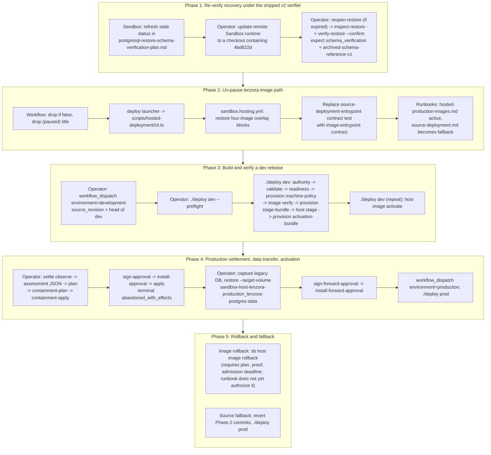

# Remediation and Implementation Plan: GitHub Signed Image Deployment for Lenzora

Revised 2026-09-10 against the actual code in `/Users/alim/Sites/git/sandbox`
(branch `latest`, HEAD `f5455cb`) and `/Users/alim/Sites/git/lenzora`
(HEAD `11fff7806`). Every assertion below was checked against source; the
"Verification log" at the end lists the evidence and the verdict for each one.
Anything that could not be checked from source alone is marked UNVERIFIED.

## Executive Summary and Current Operational State

Lenzora currently deploys from source (`sb host apply`, driven by
`./deploy dev|prod` -> `scripts/source-deployment/cli.ts`). The GitHub Actions
signed-image pipeline `.github/workflows/prepare-hosted-production-images.yml`
is paused with `if: ${{ false }}` on its only job (lenzora commit `5c051bee6`,
2026-09-10, "Restore source-based hosted deployment path"). That same commit
flipped the `deploy` launcher from `scripts/hosted-deployment/cli.ts` to the
source path, reverted `sandbox.hosting.yml` from the four-image compose overlay
to `build: true` source compose, and added a contract test that pins all three
reverts.

The earlier version of this document described five "blockers". Checking the
code shows that three of them are already resolved and one was never a real
choice:

| Blocker as originally described | Actual state (2026-09-10) |
|---|---|
| 1. Schema digest mismatch (`all_match=false`, 19 constraint definitions) blocks restore verification | Fixed in sandbox commit `4bd622d` (2026-09-09): `schema_fingerprint_version: 2`, `schema_structure_digest`, networkless reference restore, receipt method `archived-schema-reference-v1`. Code and unit tests exist. What remains is re-running the live development drill. |
| 2. Containment refuses on `container_restarting` | Fixed in sandbox commit `72ab426`: `private_containment.py` now accepts Docker's exact restart-wait state (`Running=true, Restarting=true, Pid=0, Status=restarting`) in `containment-plan`; lenzora's own plan records three restart-loop canaries passing. The alleged `WEBHOOK_ENCRYPTION_KEY` base64 cause is UNVERIFIED (no evidence anywhere in either repo). |
| 3. Uncertain generation-0 production activation | Real. Production retains an uncertain activation (`effect_entered=true`) at generation 0, transaction `sha256:dcc9f85b3d8a155f6589290acb96d8382aff1b79e6ab006f88d7e7d4d61247b9` (recorded 2026-09-08). Settlement tooling exists (`sb host image settle`, nine phases); it has not been run to completion. Live state UNVERIFIED from source. |
| 4. Three-image vs four-image contract undecided | Already decided in code: BOTH environments use the v2 four-image receipt with local containerized PostgreSQL (`docker-compose.hosted-production.yml` declares `lenzora-db` from `LENZORA_DATABASE_IMAGE`; runbook: "Both environments use local PostgreSQL"). The v1 three-image schema is retained for historical compatibility only. The real open item is the production data cutover from the external `LENZORA_PRODUCTION_DATABASE_URL` database to the local volume. |
| 5. Cosign keyless signing and bundle packaging need standardizing | Already implemented exactly as the sandbox verifier requires. The workflow signs simple-signing payloads with `cosign sign-blob --bundle` (cosign v3.1.3), verifies offline in CI, and the receipt scripts already emit v2 for both environments. No workflow logic changes are needed beyond un-pausing. |

So the remaining work is small and mostly operational: un-pause the workflow
and launcher in lenzora (with the contract test), restore the image-mode
hosting manifest, re-run the development restore drill under the new verifier,
settle the production incident, transfer production data to the local volume,
and run `./deploy dev` then `./deploy prod`.

Limitations of source deployment that motivate the return (unchanged):
long remote builds (`build_timeout_seconds: 3600` for production), host
dependency on git checkout and node toolchains, no immutable provenance at
activation time, and drift risk between instances.

---

## Technical Analysis (corrected)

### 1. Restore schema verification: implemented, drill not re-run

`sandbox/recovery/postgres_helper.py` (1337 lines) now:

- writes `schema_fingerprint_version: 2` and `schema_structure_digest` into
  every new observation/capture (lines 396-397, 463-464);
- keeps the raw `schema_digest` unchanged for compatibility (line 124 `_schema_digest`,
  line 135 `schema_structure_digest` drops only constraint `definition`);
- when the raw schema is the sole mismatch, runs `pg_restore --schema-only
  --exit-on-error --no-owner --no-acl` of the archived dump into a separate
  owned container using the pinned client image, compares the structural digest,
  records `reference_schema_digest` (lines 636-680 `_schema_reference`), and
  emits method `archived-schema-reference-v1` (lines 682-707 `verify_observation`);
- for legacy v1 archives on profile `lenzora-dev` only, derives the structural
  baseline from the live registered source when its raw digest still matches the
  capture (`_captured_structure`, lines 607-617, origin `legacy-live-capture-match`).

`inspect-restore`, `verify-restore`, and `reopen-restore` are restricted to
`source['profile'] == 'lenzora-dev'` with no `--target-volume` (line 1168 and
`sandbox/transports/remote_postgres_recovery.py:53`). Production uses the
separate transfer path (`restore --target-volume ...`).

Tests: `tests/test_recovery_postgres_reference.py`,
`tests/test_recovery_postgres_reference_lifecycle.py`, `tests/test_recovery_postgres.py`,
and the integration canary `tests/integration/recovery_schema_reference_canary.py`
(real Docker, pg_dump, pg_restore; not mocked).

Stale documentation: `docs/postgresql-restore-schema-verification-plan.md:3`
still says "Implementation and live acceptance are not complete" against
`fd7d650`. Implementation is complete as of `4bd622d`; live acceptance is not.

### 2. Containment of restarting containers: implemented

`sandbox/hosting/images/activation/private_containment.py:55-65`: a container
with `Restarting=true` is accepted only in the precise shape
`Running=true, Pid=0, Status=restarting`; any other combination is
`container_state_invalid`. `containment-apply` then runs
`docker update --restart=no` and `docker stop --time 30` on the exact approved
IDs (lines 101-104). The old unconditional
`raise ValueError('container_restarting')` was added in `c1ade45` and removed
in `72ab426`; the code string survives only in accepted-code lists
(`settlement_service.py:17`, `settlement_observer.py:50`, `private_containment.py:121`).

The root cause of the production container flapping is NOT established in
either repo. `WEBHOOK_ENCRYPTION_KEY` appears in lenzora only as a secret
mapping (`sandbox.hosting.yml:120,332`) and a 2026-08-17 note that the key was
missing from a scoped secrets file (`TODO.md:37`); nothing mentions URL-safe
versus standard base64. Treat the crash cause as an open diagnostic item.

### 3. Uncertain generation-0 activation: real, tooling exists

`sandbox/hosting/images/activation/models.py:36-39` defines `uncertain` as a
terminal phase. `sandbox/commands/hosting.py:4059,4472` raise
`"active activation forbids candidate preparation"` while an activation is
active. `docs/audits/2026-09-08-sandbox-delivery-review/report.md:176` records
the production status: generation 0, null revisions, uncertain activation with
`effect_entered=true`. Lenzora's `docs/runbooks/deployment-simplification-plan.md:273-276`
records the transaction digest.

The settlement protocol is `sb host image settle --settlement-phase <phase>`
with phases (from `sandbox/cli.py:944-946`):
`observe`, `plan`, `containment-plan`, `containment-apply`, `sign-approval`,
`sign-forward-approval`, `install-approval`, `install-forward-approval`, `apply`.
Every phase requires `--request-id` and `--expected-generation`; `observe` and
`plan` require `--activation-transaction sha256:...`; every phase except
`observe`, `plan`, `containment-plan` requires `--confirm`
(`settlement_cli.py:56-61`). The terminal receipt code is `abandoned_with_effects`
(`settlement_repository.py:377`). Sandbox signs approvals with the installed
authority's Ed25519 key via `SettlementSshSigner` (namespace
`sandbox-feature-051-settlement`), or accepts an externally signed approval via
`--approval-file` + `--approval-public-key`.

`--settlement-data-assessment` takes a PATH to a closed JSON document with
exactly the fields `schema_version` (1), `target`, `transaction_digest`,
`application_revision` (40-hex), `backup_receipt_digests` (1-8 sorted digests),
`compatibility` (`"forward_initialization_reviewed"`), and `assessment_digest`
(domain `sandbox.hosting.images.settlement-data-assessment.v1`)
(`settlement_models.py:34-36,186-250`). The earlier plan's inline
`'{"code":"lossless",...}'` was wrong.

The earlier claim that generation 0 "cannot rely on existing listeners" has no
basis in the activation code (no such concept exists) and is dropped.

### 4. Receipt contracts: both repos agree, v2 four images for both environments

Sandbox `sandbox/hosting/images/plan_set.py`:
`IMAGE_NAMES = ("queue", "web", "worker")` (line 34),
`LOCAL_DATABASE_IMAGE_NAMES = ("database", *IMAGE_NAMES)` (line 35),
`HostedProductionReceiptV1` (line 408, `schema_version 1`, exactly 3 images),
`HostedLocalDatabaseReceiptV2` (line 446, `schema_version 2`, exactly 4 images,
target `development`/`production`, ref `refs/heads/dev`/`refs/heads/main`).
Mismatches raise `PlanSetContractError("receipt_mismatch")` or `"policy_mismatch"`.

Lenzora `src/types/hosted-production-image-receipt.ts`:
`hostedProductionImageReceiptSchema` (v1, `images.min(3).max(3)`, names
`queue,web,worker`, ref `refs/heads/main`), `hostedLocalDatabaseImageReceiptSchema`
(v2, `images.length(4)`, names `database,queue,web,worker`, identity hard-coded
to `https://github.com/alimuzzaman/lenzora/.github/workflows/prepare-hosted-production-images.yml@<ref>`,
which matches `git remote -v`).

Lenzora `scripts/create-hosted-production-image-receipt.ts:163-182`: when
`--environment` is passed (the workflow always passes it), the receipt is
`createHostedImageReceipt` -> `schema_version: 2` with four images for BOTH
`development` and `production`. The v1 path is only reached when `--environment`
is omitted. The receipt scripts need no changes.

Lenzora `scripts/validate-hosted-production-image-receipt.ts` enforces an exact
file set: v1 = 9 files (`receipt.json`, `receipt.sha256`, `receipt.bundle`, plus
`{queue,web,worker}.{payload.json,bundle}`); v2 = 11 files (adds
`database.payload.json`, `database.bundle`). Limits: receipt 256 KiB, each proof
512 KiB, checksum 128 B. It verifies each bundle with
`cosign verify-blob --offline --new-bundle-format` bound to the receipt's
issuer/identity/repository/ref/sha, and checks each payload's
`critical.identity.docker-reference` and `critical.image.docker-manifest-digest`.

Compose: `docker-compose.hosted-production.yml` declares `lenzora-db`
(`LENZORA_DATABASE_IMAGE`), `lenzora-job-queue` (`LENZORA_QUEUE_IMAGE`),
`lenzora-web` (`LENZORA_WEB_IMAGE`), and all workers plus the three initializers
`lenzora-migrate` (runs `hosted-migration-preflight.ts` then
`prisma migrate deploy`), `lenzora-storage-init`, `lenzora-job-queue-topology-gate`
from `LENZORA_WORKER_IMAGE`; volumes `lenzora-postgres-data`, `lenzora-storage`.
`Dockerfile` has targets `queue` (redis 7.4.11), `database` (postgres
16.15-alpine), `runner` (web), `worker`.

### 5. Cosign signing and offline verification: already compliant

Workflow (`prepare-hosted-production-images.yml`): `sigstore/cosign-installer`
with `cosign-release: v3.1.3`; `imjasonh/setup-crane`; four
`docker/build-push-action` steps with `platforms: linux/amd64`,
`provenance: mode=max`, `sbom: true`; `crane digest --platform linux/amd64`
resolves the platform manifest digest; a simple-signing payload
`{critical:{identity:{docker-reference},image:{docker-manifest-digest},type},optional:{}}`
is written per image and signed with `cosign sign-blob --yes --bundle`, then
verified offline with all five `--certificate-*` claims and checked for
`mediaType application/vnd.dev.sigstore.bundle.v0.3+json`; `receipt.json` is
signed with `cosign sign-blob --yes --new-bundle-format`; the validator runs
in CI; the artifact `hosted-<env>-images-<sha>` uploads `activation-bundle/` and
`hosted-<env>-preparation-evidence.json` with 90-day retention.

Note: the earlier plan's `cosign sign --yes --bundle ... <image>@<digest>`
(container signing) is NOT what the pipeline does and would not produce the
payload files the validator and sandbox verifier expect. Do not "standardize"
to it.

Sandbox verifier `sandbox/hosting/images/plan_set.py:477 CosignOfflineVerifier`
runs `cosign verify-blob --offline --new-bundle-format` (line 494), requires
issuer `https://token.actions.githubusercontent.com` (line 200), and bounds
bundles at depth 16, 16384 nodes, 256 B keys, 256 KiB strings, 128 KiB per v2
document, 1 MiB per bundle, 6 MiB per local-database bundle set (lines 25-33).

Workflow trigger reality: `workflow_dispatch` only, inputs `environment`,
`source_revision` (40 lowercase hex), `public_url`. The first step asserts
`github.workflow_sha == source_revision`, `github.ref == refs/heads/dev|main`
per environment, and the public URL is exactly `https://lenzora.dev` or
`https://lenzora.app`. Adding `push:` triggers (as the earlier plan proposed)
would fail this step because `source_revision` would be empty. Keep dispatch-only.

GitHub `environment: hosted-<env>-image-preparation` is referenced; whether
those environments exist and what secrets they hold is UNVERIFIED (no API calls
were made).

---

## Phased Remediation Plan (corrected)



---

## Ordered Task List

Legend: **[S]** code/docs change in `/Users/alim/Sites/git/sandbox`;
**[L]** code/docs change in `/Users/alim/Sites/git/lenzora`;
**[O]** operational step requiring the human operator and/or remote access.
Tasks are ordered by dependency. No task below runs `git stash`, `git reset`,
`git checkout -- .`, or creates tags.

### Phase 1: Re-verify recovery under the shipped v2 verifier

**T1 [S] Refresh the stale status line in the schema verification plan.**
File: `/Users/alim/Sites/git/sandbox/docs/postgresql-restore-schema-verification-plan.md`, line 3.
Change "Status: planned on 2026-09-08 against `fd7d650...`. Implementation and
live acceptance are not complete." to state that implementation landed in
`4bd622d` (2026-09-09) with unit tests and the integration canary, and that live
acceptance on the development drill is still pending. Do not change the
contract sections.
Acceptance: `grep -n "4bd622d" docs/postgresql-restore-schema-verification-plan.md` returns line 3;
`./sb selftest` still passes (the file is docs-only).

**T2 [S, local Docker] Run the reference-restore canary once as evidence.**
Command (from `/Users/alim/Sites/git/sandbox`, requires a locally installed
pinned PostgreSQL image; read the module docstring for the exact argument list):
`python -m tests.integration.recovery_schema_reference_canary --help`.
Acceptance: canary exits 0; record the run in the commit message or a note
under `tmp/` (gitignored). This is optional if the operator is going straight
to the remote drill in T4.

**T3 [O] Update the installed Sandbox runtime on `scaleway-sandbox` to a
revision that contains `4bd622d`.**
Lenzora's `scripts/hosted-deployment/defaults.ts` refuses client/controller
revision skew, and `sb host image settle` returns
`remote_runtime_revision_mismatch` when the remote is stale. Use the supported
service lifecycle (`sb remote ...` / `sb deploy --remote scaleway-sandbox`) from
a clean local checkout. Never push tags.
Acceptance: `./sb host image status --project-dir <lenzora> --environment development --remote scaleway-sandbox --json`
returns `ok: true` (not `remote_runtime_revision_mismatch`).

**T4 [O] Re-run the development restore drill.**
Retained artifacts (verified present, owner-only) in
`/Users/alim/Sites/git/sandbox/tmp/lenzora-data-sources-20260908/`:
`development-restore-plan.json` (PLAN.json below), `development-reopen-plan.json`
(a reopen plan from 2026-09-08 22:05; it may be stale, so prefer the fresh
`reopen_plan` returned by `inspect-restore`), and `development.json` (source
descriptor). Sequence, from `/Users/alim/Sites/git/sandbox`:
```sh
./sb recovery data --postgres-operation inspect-restore --remote scaleway-sandbox --profile lenzora-dev --restore-plan PLAN.json --json
# if it returns restore_target_stopped with a reopen_plan, save that object as REOPEN.json and:
./sb recovery data --postgres-operation reopen-restore --remote scaleway-sandbox --profile lenzora-dev --restore-plan PLAN.json --reopen-plan REOPEN.json --confirm --json
./sb recovery data --postgres-operation inspect-restore --remote scaleway-sandbox --profile lenzora-dev --restore-plan PLAN.json --json
./sb recovery data --postgres-operation verify-restore --remote scaleway-sandbox --profile lenzora-dev --restore-plan PLAN.json --confirm --json
./sb recovery data --postgres-operation readiness --remote scaleway-sandbox --profile lenzora-dev --target-volume sandbox-host-lenzora-development_lenzora-postgres-data --json
```
The archive is a v1 capture, so the structural baseline comes from
`legacy-live-capture-match` (requires the registered dev source's raw schema to
still equal the capture; otherwise take a fresh capture, which will be v2).
Acceptance: `verify-restore` returns a receipt whose `schema_verification`
method is `archived-schema-reference-v1` (or `raw-capture-equality`), and
`readiness` returns `data_ready`. `all_match=false` on `inspect-restore` alone
is expected and is not a failure; acceptance is the `verify-restore` receipt.

### Phase 2: Un-pause the lenzora image path

These are the exact inverse of lenzora commit `5c051bee6` (except the runbook
banner text). Do them in one lenzora branch cut from `dev`; publish with
`git push -u origin <branch>` and verify `git rev-parse --abbrev-ref @{upstream}`
is `origin/<branch>`.

**T5 [L] Workflow.** `.github/workflows/prepare-hosted-production-images.yml`:
change `name: Prepare immutable hosted images (paused)` to
`name: Prepare immutable hosted images`; delete the two comment lines and the
`if: ${{ false }}` line under `jobs.prepare-images`. Change nothing else; the
build, sign, receipt, validate, and upload steps are already correct.
Acceptance: `actionlint` passes; `grep -c 'if: \${{ false }}' .github/workflows/prepare-hosted-production-images.yml` is 0.

**T6 [L] Launcher.** `deploy` (root, 903 bytes): change the final `exec` line's
target from `scripts/source-deployment/cli.ts` back to
`scripts/hosted-deployment/cli.ts`. Keep the tsx and Node preflight lines.
Acceptance: `./deploy dev --preflight --json` runs the hosted-deployment
preflight (it will report blockers about gh, cosign, defaults, or runtime;
that is fine at this step).

**T7 [L] Hosting manifest.** `sandbox.hosting.yml`: restore the image-mode
blocks removed in `5c051bee6` for both environments:
- production `compose.files: [docker-compose.yml, docker-compose.db.yml, docker-compose.production-redis.yml, docker-compose.hosted-production.yml]`, `build: false`, remove `build_timeout_seconds`, `init_services: [lenzora-migrate, lenzora-storage-init, lenzora-job-queue-topology-gate]`, add `lenzora-db` and `lenzora-job-queue` to `background_services`, restore `LENZORA_POSTGRES_VOLUME: sandbox-host-lenzora-production_lenzora-postgres-data` and `LENZORA_STORAGE_VOLUME: sandbox-host-lenzora-production_lenzora-storage`, and remove the `LENZORA_DATABASE_URL: LENZORA_PRODUCTION_DATABASE_URL` mapping;
- development `compose.files: [docker-compose.yml, docker-compose.db.yml, docker-compose.hosted-production.yml, docker-compose.hosted-dev-images.yml]`, `build: false`, the same three init services, `lenzora-db` and `lenzora-job-queue` in background services, `LENZORA_POSTGRES_VOLUME: sandbox-host-lenzora-development_lenzora-postgres-data`.
Use `git show 5c051bee6 -- sandbox.hosting.yml` as the authoritative diff.
The image environment variables `LENZORA_{DEVELOPMENT,PRODUCTION}_{DATABASE,QUEUE,WEB,WORKER}_IMAGE`
are bound by `scripts/hosted-deployment/native.ts:110` via
`--activation-environment-binding`; check that the manifest still declares them.
Acceptance: `sb host validate --project-dir . --environment development --json`
and `--environment production --json` succeed and report `compose.init_services`
with three entries and `compose.background_services` including `lenzora-db`.

**T8 [L] Contract test.** `tests/contract/source-deployment-entrypoint.contract.test.ts`
currently asserts the launcher targets `source-deployment/cli.ts`, that the
manifest contains `files: [docker-compose.yml, docker-compose.production-redis.yml]`
and `build_timeout_seconds: 3600`, and that the workflow contains the paused
title and `if: ${{ false }}` (lines 9-10, 24-29). Replace it with an
image-entrypoint contract: launcher targets `hosted-deployment/cli.ts`;
manifest contains `docker-compose.hosted-production.yml` for both environments
and `build: false`; workflow name has no "(paused)" and contains no `if: ${{ false }}`.
Keep the `source-deployment/cli.ts` assertions that it contains `'host', 'apply'`
and `'job-start'` since that CLI remains as the fallback.
Acceptance: `pnpm vitest run tests/contract` passes.

**T9 [L] Runbooks.** `docs/runbooks/hosted-production-images.md`: remove the
"Paused (2026-09-10)" blockquote. `docs/runbooks/source-deployment.md`: change
the first paragraph to describe it as the fallback path, and document that
switching back requires reverting T5-T8. `docs/runbooks/README.md`, `README.md`,
`AGENTS.md`: point the deployment entry at the image runbook (see the
`5c051bee6` diff for the exact lines that changed).
Acceptance: `grep -rn "paused" docs/runbooks/hosted-production-images.md` returns nothing.

**T10 [L] Optional: decide on image rollback wording.** `docs/runbooks/release-rollback.md:28-30`
says the runbook "intentionally provides no runnable rollback command yet" and
does not accept the old `sb host rollback`. `sb host image rollback` now exists
(Feature 051). Either document it with its real requirements (see T17) or leave
the prohibition and make T17 an explicit operator decision. This is a policy
choice, not a code fix.

### Phase 3: Build and verify a development release

**T11 [O] Confirm GitHub prerequisites (UNVERIFIED from source).**
GitHub environments `hosted-development-image-preparation` and
`hosted-production-image-preparation` must exist (the job uses
`environment: hosted-${{ inputs.environment }}-image-preparation`). Secret
`SENTRY_AUTH_TOKEN` is optional (its absence records `skipped`). `GITHUB_TOKEN`
needs `packages: write` (declared). Register `personal/GHCR_READ_TOKEN` in the
Sandbox secret source on the deploying machine (used by
`--credential-source-reference` in `native.ts:120`); use the `secret-inspection`
skill, never read the file.

**T12 [O] Dispatch the development build.** After T5-T9 are merged to `dev`:
`gh workflow run prepare-hosted-production-images.yml --ref dev -f environment=development -f source_revision=$(git rev-parse origin/dev)`.
The first step requires `source_revision` to equal the workflow's own SHA, so
the ref head and the revision must be the same commit.
Acceptance: run succeeds; artifact `hosted-development-images-<sha>` exists with
11 files in `activation-bundle/` plus `hosted-development-preparation-evidence.json`.

**T13 [O] Preflight.** From the lenzora checkout on the deploying machine:
`./deploy dev --preflight --json`. Exit 0 required. It checks tool presence
(gh, cosign), clean checkout, `~/.lenzora-deployment/defaults.json`, and that
the installed remote Sandbox runtime matches the local sandbox checkout.

**T14 [O] Prepare and activate development.** `./deploy dev` (repeat the same
command after approval if it stops at "action needed"). Internally
(`scripts/hosted-deployment/native.ts`) it runs, in order:
```
sb host image authority --project-dir . --environment development --remote scaleway-sandbox --json
sb host validate ... --json
sb recovery data --postgres-operation readiness --remote scaleway-sandbox ... --json   (database and storage)
sb host image provision ... --provision-phase machine-policy --signed-receipt-directory <bundle> \
   --policy-authority-id machine-policy/lenzora-development --policy-revision 1 --use-installed-authority \
   --service-image-binding <svc>=database|queue|web|worker (one per service) \
   --activation-environment-binding database=LENZORA_DEVELOPMENT_DATABASE_IMAGE (x4) --confirm --json
sb host image verify --machine-plan-set-policy <installed_path> --signed-receipt-directory <bundle> --json
sb host image provision ... --provision-phase stage-bundle --verified-plan plan.json --expected-generation G \
   --credential-source-reference personal/GHCR_READ_TOKEN --credential-expires-at <RFC3339> --confirm --json
sb host stage ... --verified-plan plan.json --request-id <stage id> --expected-generation <stage_generation> --confirm --json
sb host image provision ... --provision-phase activation-bundle --verified-plan plan.json --staged-proof proof.json \
   --expected-generation G --snapshot-expires-at <epoch> --grant-ttl-seconds 3600 --candidate-input-contract candidate-v2 --confirm --json
sb host image activate ... --request-id <activation id> --expected-generation G --verified-plan plan.json \
   --staged-proof proof.json --admission-deadline <RFC3339> --confirm --json
```
Prerequisite: an installed authority for the development target on the
deploying machine (`sb host image authority` must return `ok: true`). Initial
authority installation is the separate `--provision-phase machine-policy` call
WITHOUT `--use-installed-authority`, passing `--rollback-public-key PATH
--rollback-authority-id ID --rollback-authority-revision N`; that is a reviewed
operator action, not something `./deploy` does.
Acceptance: `./deploy dev` reports terminal committed activation;
`sb host image status --project-dir . --environment development --remote scaleway-sandbox --json`
shows generation G+1; `https://lenzora.dev/api/health` returns 200 behind Basic
Auth; all 18 services plus three initializer exits are recorded.

### Phase 4: Production settlement, data transfer, activation

**T15 [O] Settle the retained uncertain production activation.** Selectors for
every command: `--project-dir <lenzora> --environment production --remote scaleway-sandbox --json`.
Use one `SETTLEMENT_ID` throughout and `--expected-generation 0` (confirm with
`sb host image status` first; the transaction digest recorded on 2026-09-08 is
`sha256:dcc9f85b3d8a155f6589290acb96d8382aff1b79e6ab006f88d7e7d4d61247b9`).
```sh
./sb host image settle --settlement-phase observe <selectors> --request-id SETTLEMENT_ID --expected-generation 0 --activation-transaction sha256:TX
# not_quiescent expected while containers run or restart-loop:
./sb host image settle --settlement-phase containment-plan <selectors> --request-id SETTLEMENT_ID --expected-generation 0 --activation-transaction sha256:TX
# review the plan, then:
./sb host image settle --settlement-phase containment-apply <selectors> --request-id SETTLEMENT_ID --expected-generation 0 --activation-transaction sha256:TX --confirm
./sb host image settle --settlement-phase observe ...   # must now be quiescent
```
Write `assessment.json` as a closed `SettlementDataAssessment` (fields in
section 3 above; `backup_receipt_digests` must reference real capture receipts
from T16a, so run T16a's capture before this step). Then:
```sh
./sb host image settle --settlement-phase plan <selectors> --request-id SETTLEMENT_ID --expected-generation 0 --activation-transaction sha256:TX --settlement-data-assessment assessment.json
# save the nested "plan" object as plan.json, review it, then:
./sb host image settle --settlement-phase sign-approval <selectors> --request-id SETTLEMENT_ID --expected-generation 0 --settlement-plan plan.json --confirm
./sb host image settle --settlement-phase install-approval <selectors> --request-id SETTLEMENT_ID --expected-generation 0 --settlement-plan plan.json --approval-file approval.json --approval-public-key operator.pub --confirm
./sb host image settle --settlement-phase apply <selectors> --request-id SETTLEMENT_ID --expected-generation 0 --settlement-plan plan.json --settlement-approval sha256:APPROVAL --confirm
```
(`sign-approval` uses the installed authority's key; if the operator signs
externally, skip it and produce `approval.json` per `docs/image-activation-settlement.md`.)
Acceptance: `apply` returns `code: abandoned_with_effects`, `ok: true`;
`sb host image status` shows no active transaction at generation 0. Full
reference: `/Users/alim/Sites/git/sandbox/docs/image-activation-settlement.md`.

**T16 [O] Production data transfer to the local PostgreSQL volume.**
Production source deployment currently uses the external
`LENZORA_PRODUCTION_DATABASE_URL`; image mode uses the local volume
`sandbox-host-lenzora-production_lenzora-postgres-data`, which must NOT exist
before transfer. Per `docs/hosted-data-recovery.md:189-201`:
- T16a: register the legacy production source binding (needs database name and
  login role, which lenzora's plan records as still missing inputs), `observe`,
  then `capture --confirm` after T15 containment has stopped the writers.
- T16b: `restore-plan`, then `restore --target-volume sandbox-host-lenzora-production_lenzora-postgres-data --confirm`.
- T16c: `readiness --profile <production profile> --target-volume sandbox-host-lenzora-production_lenzora-postgres-data --json` must return `data_ready` with the confirmed transfer receipt.
Also capture and restore the storage volume (`lenzora-storage`) per the same
document. Take `./sb snapshot` style evidence where the tooling offers it;
never delete the legacy database.

**T17 [O] Forward approval, production build, production activation.**
```sh
./sb host image settle --settlement-phase sign-forward-approval <selectors> --request-id NEW_ACTIVATION_ID --expected-generation 0 --forward-review review.json --settlement-data-assessment assessment.json --confirm
./sb host image settle --settlement-phase install-forward-approval <selectors> --request-id NEW_ACTIVATION_ID --expected-generation 0 --approval-file forward.json --approval-public-key operator.pub --confirm
```
(`./deploy prod` writes the review package and can discover an installed
matching approval; see `docs/runbooks/hosted-production-images.md`
"First production cutover".) Then dispatch the production build with
`--ref main -f environment=production -f source_revision=$(git rev-parse origin/main)`
and run `./deploy prod --preflight`, then `./deploy prod` (twice if it stops for
approval). The activation passes `--settlement-forward-approval sha256:... --settlement-predecessor sha256:...`
as forward arguments.
Acceptance: terminal committed activation at generation 1; `https://lenzora.app/api/health`
200; Cloudflare edge proof recorded (`edge_proof` requirement is mandatory for v2).

### Phase 5: Rollback and fallback

**T18 [O] Image rollback (only if T10 authorizes it).** `sb host image rollback`
shares `_cmd_host_image` with `activate` and requires `--verified-plan PATH
--staged-proof PATH --admission-deadline RFC3339 --request-id ID
--expected-generation G --confirm` plus the machine bundle's rollback grant; it
selects the retained `previous` owner state, not the candidate plan
(`hosting.py:5300-5305, 5426-5441`). The earlier plan's invocation without the
plan/proof/deadline arguments would be refused. Terminal `ready` is required;
`rollback_indeterminate` is a stop condition (lenzora `release-rollback.md:69-71`).

**T19 [L, O] Source fallback.** Revert T5-T9 in a single lenzora commit
(mirror of `5c051bee6`), then `./deploy prod` which submits
`sb host apply --project-dir <checkout> --environment production --remote scaleway-sandbox --confirm --json`
as a durable `job-start` job (`scripts/source-deployment/cli.ts:164-184`).
Note that source-mode production points at the external database again; if
T16 has already transferred data, the fallback manifest must be updated to keep
using the local volume or writes will diverge. Decide this before T16.

---

## Acceptance Verification Matrix

| Phase | Item | Command / artifact | Success criteria |
|---|---|---|---|
| 1 | Dev restore verified | `sb recovery data --postgres-operation verify-restore --remote scaleway-sandbox --profile lenzora-dev --restore-plan PLAN.json --confirm --json` | receipt `schema_verification.method` is `archived-schema-reference-v1` or `raw-capture-equality` |
| 1 | Dev data ready | `sb recovery data --postgres-operation readiness ... --target-volume sandbox-host-lenzora-development_lenzora-postgres-data --json` | `data_ready` |
| 2 | Workflow un-paused | `.github/workflows/prepare-hosted-production-images.yml` | no `if: ${{ false }}`; `actionlint` clean |
| 2 | Launcher and manifest | `./deploy dev --preflight --json`; `sb host validate --environment development|production --json` | preflight runs hosted path; validate reports three init services and `lenzora-db` |
| 2 | Contract test | `pnpm vitest run tests/contract` | passes with image-entrypoint assertions |
| 3 | Dev build | GitHub run for `dev` | artifact `hosted-development-images-<sha>` with 11 bundle files |
| 3 | Offline verify | `sb host image verify --machine-plan-set-policy <path> --signed-receipt-directory <bundle> --json` | `ok: true`, `plan_set.schema_version` 2, `plan_set_digest` present |
| 3 | Stage proof | `sb host stage ... --confirm --json` | `proof.schema_version` 2, `proof_digest` present |
| 3 | Dev activation | `./deploy dev`; `sb host image status ... --json` | generation incremented; `/api/health` 200 |
| 4 | Settlement | `sb host image settle --settlement-phase apply ...` | `code: abandoned_with_effects` |
| 4 | Prod transfer | `sb recovery data --postgres-operation readiness ... --target-volume sandbox-host-lenzora-production_lenzora-postgres-data` | `data_ready` with transfer receipt |
| 4 | Prod activation | `./deploy prod` | committed at generation 1; edge proof recorded; `https://lenzora.app/api/health` 200 |
| 5 | Rollback readiness | T10 decision; `sb host image rollback` argument set | runbook authorizes or explicitly forbids; no ad-hoc rollback |

---

## Verification log

Evidence paths are absolute. "Line" numbers are as of the revisions named at
the top of this document.

| # | Claim in the earlier plan | Evidence | Verdict |
|---|---|---|---|
| 1 | Workflow paused with `if: ${{ false }}` | `/Users/alim/Sites/git/lenzora/.github/workflows/prepare-hosted-production-images.yml` job `prepare-images`, `if: ${{ false }}`; title "(paused)"; commit `5c051bee6` 2026-09-10 | CONFIRMED |
| 2 | Lenzora deploys from source via `sb host apply` | `/Users/alim/Sites/git/lenzora/deploy` last line targets `scripts/source-deployment/cli.ts`; `scripts/source-deployment/cli.ts:164-165` builds `['host','apply',...,'--confirm','--json']`; `docs/runbooks/source-deployment.md:1-4` | CONFIRMED |
| 3 | v1 verifier hashes `pg_get_constraintdef` text; 307 tables / 4,264 columns / 19 constraint diffs | `/Users/alim/Sites/git/sandbox/sandbox/recovery/postgres_helper.py:30`; `docs/audits/2026-09-08-sandbox-delivery-review/report.md:134`; `docs/postgresql-restore-schema-verification-plan.md:8-11` | CONFIRMED |
| 4 | Schema fingerprint v2 must be "activated"/written | `postgres_helper.py:146-151` `_fingerprint_version`, `:396-397`, `:463-464` write version 2; `:607-617` `_captured_structure`; `:636-680` `_schema_reference` with `pg_restore --schema-only --exit-on-error --no-owner --no-acl`; `:682-707` `verify_observation` method `archived-schema-reference-v1`; commit `4bd622d` 2026-09-09 (+2081 lines incl. tests and canary) | CORRECTED: already implemented; only live drill and a stale doc status remain |
| 5 | Reference restore runs in networkless disposable container on tmpfs with pinned image | `postgres_helper.py:655-680`; `docs/hosted-data-recovery.md:127-133` | CONFIRMED |
| 6 | Restore drill is invoked as `sb host recover --project-dir lenzora --environment development` | `sandbox/cli.py:881-884`: `host recover` is failed-apply recovery; `commands/hosting.py:2507-2517` requires `--job-id --original-request-id --request-id --expected-generation`; the drill is `sb recovery data --postgres-operation inspect-restore|verify-restore|reopen-restore` (`commands/recovery.py:18`; `docs/hosted-data-recovery.md:45-47`) | CORRECTED |
| 7 | inspect/verify/reopen are limited to the dev profile | `postgres_helper.py:1168`; `transports/remote_postgres_recovery.py:53` | CONFIRMED (new) |
| 8 | Containment raises `settlement_refusal("container_restarting")` on `Restarting=true` | `private_containment.py:55-65` accepts restart-wait shape; `git show c1ade45` added `raise ValueError('container_restarting')`, `git show 72ab426` removed it; lenzora `deployment-simplification-plan.md:329-376` records canaries passing | CORRECTED: already fixed |
| 9 | Containment issues `docker update --restart=no` and `docker stop --time 30` | `private_containment.py:101-104` | CONFIRMED |
| 10 | `WEBHOOK_ENCRYPTION_KEY` URL-safe base64 caused worker crash loops | grep of both repos: only secret mappings (`lenzora/sandbox.hosting.yml:120,332`), `TODO.md:37` (key missing from scoped file, 2026-08-17), no base64-format mention anywhere | UNVERIFIED; removed as a stated cause |
| 11 | Production retains an uncertain activation at generation 0 with `effect_entered=true` | `docs/audits/2026-09-08-sandbox-delivery-review/report.md:176`; lenzora `deployment-simplification-plan.md:179,273-276` (transaction `sha256:dcc9f85b...`) | CONFIRMED as of 2026-09-08; live state UNVERIFIED |
| 12 | "active activation forbids candidate preparation" | `sandbox/commands/hosting.py:4059,4472` | CONFIRMED |
| 13 | Generation 0 "cannot rely on existing listeners" | no occurrence of "listener" in `sandbox/hosting/images/activation/` | CORRECTED: removed |
| 14 | Settlement phases are plan / approval / apply, with a `contain` phase | `sandbox/cli.py:944-946`: `observe, plan, containment-plan, containment-apply, sign-approval, sign-forward-approval, install-approval, install-forward-approval, apply`; `settlement_cli.py:54-61` | CORRECTED |
| 15 | `--settlement-data-assessment '{"code":"lossless","reason":"dev_remediation"}'` | `cli.py:948` metavar PATH; `settlement_models.py:34-36,186-250` closed fields incl. `compatibility == "forward_initialization_reviewed"` and 1-8 `backup_receipt_digests` | CORRECTED |
| 16 | Terminal receipt `abandoned_with_effects`; `SettlementPlan`, `SettlementDataAssessment`, `SettlementSshSigner` exist | `settlement_repository.py:377`; `settlement_service.py:104`; `settlement_models.py:186,250`; `settlement_signer.py:18` | CONFIRMED |
| 17 | `HostedProductionReceiptV1` = 3 images, `HostedLocalDatabaseReceiptV2` = 4 images, errors `receipt_mismatch`/`policy_mismatch` | `plan_set.py:34-41,408-461,66` | CONFIRMED |
| 18 | Production DB topology (managed vs local) is an open decision | lenzora `docker-compose.hosted-production.yml:14-15` `lenzora-db` from `LENZORA_DATABASE_IMAGE`; `docs/runbooks/hosted-production-images.md` "Both environments use local PostgreSQL"; `src/types/hosted-production-image-receipt.ts:93-94` v1 "cannot be used as proof for the additional database service" | CORRECTED: decided (v2, four images, local PostgreSQL); open item is the data transfer |
| 19 | Receipt scripts need updating to emit v2 for dev and v1-or-v2 for prod | `scripts/create-hosted-production-image-receipt.ts:163-182`: `--environment` present -> `createHostedImageReceipt` -> `schema_version: 2`, four images, for both environments; workflow always passes `--environment` | CORRECTED: no script change needed |
| 20 | Validator enforces exact file set and payload binding | `scripts/validate-hosted-production-image-receipt.ts`: `PREPARATION_BUNDLE_NAMES` (9) / `LOCAL_DATABASE_BUNDLE_NAMES` (11); `MAX_RECEIPT_BYTES` 256 KiB, `MAX_PROOF_BYTES` 512 KiB; `verifySimpleSigningPayload`; `cosign verify-blob --offline --new-bundle-format` with five `--certificate-*` flags | CONFIRMED |
| 21 | Receipt schema binds identity to the workflow path and repo | `hosted-production-image-receipt.ts:75,108` (`alimuzzaman/lenzora`); `git remote -v` = `git@github.com:alimuzzaman/lenzora.git` | CONFIRMED |
| 22 | Workflow needs `push:` triggers, `linux/amd64` pinning, cosign install | Workflow: `workflow_dispatch` only with required `source_revision`; first step asserts `WORKFLOW_SHA == SOURCE_REVISION`; all four builds `platforms: linux/amd64`; `cosign-installer` v3.1.3; `crane digest --platform linux/amd64` | CORRECTED: already done; `push:` would break input validation |
| 23 | Images are signed with `cosign sign --bundle <image>@<digest>` | Workflow "Sign images and capture offline proof bundles": per-image simple-signing payload + `cosign sign-blob --yes --bundle`; receipt via `cosign sign-blob --yes --new-bundle-format` | CORRECTED |
| 24 | Sandbox `CosignOfflineVerifier` enforces issuer, `--offline --new-bundle-format`, depth 16 / nodes 16384 / string 256 KiB | `plan_set.py:477,494,200,25-33` | CONFIRMED |
| 25 | `sb host image verify --machine-plan-set-policy <(sb host image authority ...)` | `hosting.py:3688-3697` requires both paths; `hosting.py:4233-4247` `authority` prints a public projection, not a policy; the policy path is `installed_path` from `provision --provision-phase machine-policy` (`native.ts:106-113`) | CORRECTED |
| 26 | `sb host image provision --provision-phase machine-policy|stage-bundle|activation-bundle` and the listed flags exist | `cli.py:913-936` (`--policy-authority-id`, `--policy-revision`, `--rollback-public-key`, `--rollback-authority-id`, `--rollback-authority-revision`, `--snapshot-expires-at`, `--candidate-input-contract`, `--grant-ttl-seconds`, `--use-installed-authority`, `--service-image-binding`, `--activation-environment-binding`, `--credential-source-reference`, `--credential-expires-at`) | CONFIRMED; plan omitted `--credential-source-reference`/`--credential-expires-at` for stage-bundle and the service/environment bindings |
| 27 | `sb host stage --verified-plan PATH` | `cli.py:881,909`; `native.ts:126-127` adds `--request-id --expected-generation --confirm` | CONFIRMED with added required flags |
| 28 | `sb host image activate --expected-generation --request-id --confirm` | `hosting.py:5300-5305` also requires `--verified-plan --staged-proof --admission-deadline`; `native.ts:182-186` | CORRECTED |
| 29 | `sb host image rollback --expected-generation --request-id --confirm` | same required trio as activate (`hosting.py:5300-5305`), selects `owner_state['previous']` (`:5426-5441`); lenzora `release-rollback.md:28-30` provides no runnable rollback yet | CORRECTED |
| 30 | `sb host image status` usage | `hosting.py:5567-5588`; `cli.py:883` | CONFIRMED |
| 31 | `sb host apply ... --request-id` fallback | `cli.py:881,907`; `source-deployment/cli.ts:164-184` wraps it in `job-start` with `--confirm` | CONFIRMED with `--confirm` added |
| 32 | `./deploy` orchestrates the full image flow | `scripts/hosted-deployment/native.ts:96-192` | CONFIRMED (new) |
| 33 | Contract test pins the source path, manifest, and paused workflow | `tests/contract/source-deployment-entrypoint.contract.test.ts:9-10,24-29` | CONFIRMED (new) |
| 34 | `sandbox.hosting.yml` was reverted to source mode | `git show 5c051bee6 -- sandbox.hosting.yml` | CONFIRMED (new) |
| 35 | Migrations run in one-shot `lenzora-migrate` | `docker-compose.hosted-production.yml:22-38` (worker image, `hosted-migration-preflight.ts` then `prisma migrate deploy`, 300 s timeout) | CONFIRMED |
| 36 | GitHub environments `hosted-<env>-image-preparation` exist with required secrets | workflow references them; no API call made | UNVERIFIED |
| 37 | Remote installed authority and `personal/GHCR_READ_TOKEN` registration | `docs/runbooks/hosted-production-images.md` "One deployment run, two durable phases"; not checked live | UNVERIFIED |
| 38 | Retained dev restore plan path | `/Users/alim/Sites/git/sandbox/tmp/lenzora-data-sources-20260908/` contains `development-restore-plan.json` (763 B, 2026-09-08 18:46), `development-reopen-plan.json` (1170 B, 2026-09-08 22:05), `development.json` (source descriptor); owner-only `0700`/`0600` | CONFIRMED |
