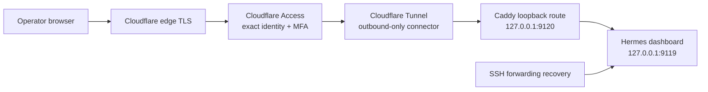

# Hermes public dashboard access — architecture and pre-spec plan

**Status:** ARCHITECTURE DECIDED — ready for `speckit-specify`
**Target hostname:** `https://hermes.asb.bd`
**Target remote:** `scaleway-sandbox`
**Prepared:** 2026-07-12

This document is the reviewed product/architecture input for a new Spec-Kit feature.
It is not itself a feature specification, task list, deployment approval, or authority
to change Cloudflare, DNS, the VPS, secrets, or a production service.

The new feature should be created separately from completed features 015 and 016.
Feature 015 supplies reusable Caddy/Cloudflare plan-and-rollback patterns. Feature 016
supplies the gated, loopback-only Hermes dashboard lifecycle. This plan defines the
missing authenticated public-access layer.

**Implementation increment decision (2026-07-12):** The first implementation attaches
to and validates pre-created exact Cloudflare Access, Tunnel, and DNS resources. Sandbox
owns only its local Caddy route, connector service, and non-secret exposure state.
Creating or editing Access policies is deferred because it requires an operator identity
or group and higher account-level authority that must not be inferred by the CLI.

## 1. Outcome

Allow the single Sandbox operator to open `https://hermes.asb.bd` from a browser
without an SSH tunnel while keeping Hermes bound to loopback and preserving SSH
forwarding as the recovery path.

The public route must:

- require a deny-by-default Cloudflare Access policy before any request reaches the VPS;
- use a Cloudflare Tunnel so Hermes has no public origin listener and cannot be reached
  by bypassing Cloudflare;
- optionally require Caddy Basic Auth as an additional shared-secret gate;
- preserve the upstream Hermes dashboard and its existing `$HOME/.hermes` state;
- support browser HTTP, callback redirects, static assets, streaming responses, and
  WebSocket/PTY traffic;
- be entirely plan-first, confirmation-gated, idempotent, health-checked, and reversible;
- leave the current SSH-forwarded loopback access working after failed exposure or
  unexposure.

## 2. Non-goals

- No custom Hermes dashboard or fork of the upstream UI.
- No direct public bind of Hermes to `0.0.0.0` or the VPS address.
- No `--insecure` Hermes mode.
- No public exposure of Sandbox MCP, the Hermes gateway, WordPress admin, SSH, or a
  container socket.
- No multi-tenant authorization model. This remains a trusted single-operator service.
- No replacement of Caddy for existing hosted container applications.
- No assumption that Basic Auth is MFA or a substitute for Cloudflare Access.
- No live DNS, Access, tunnel, Caddy, firewall, or service mutation during specification
  and implementation planning.

## 3. Current state and gap

Feature 016 already manages an upstream Hermes dashboard service on
`127.0.0.1:9119`, verifies that there is no public listener, and requires current V2
acceptance evidence. Its `dashboard expose` command is intentionally a fail-closed
stub that returns `feature_015_required`.

Feature 015 already provides:

- normalized hostnames;
- Cloudflare zone/DNS and Origin CA helpers;
- Caddy fragment validation and reload;
- read-only planning;
- confirmation-gated apply;
- integration-owned state and rollback patterns.

It does not provide Cloudflare Zero Trust Access applications, Access policies,
Cloudflare Tunnel lifecycle, Access-token validation, or a protected route for a
host-native loopback service. The existing zone token must not silently gain those
account-level capabilities.

Upstream Hermes has its own Nous Portal OAuth gate for non-loopback binds, but the
existing Sandbox safety invariant intentionally keeps Hermes on loopback. The new
public layer therefore uses Cloudflare Access as the primary browser identity gate.

## 4. Selected architecture



Request path:

```text
https://hermes.asb.bd
  -> Cloudflare edge TLS
  -> Cloudflare Access self-hosted application
  -> named Cloudflare Tunnel
  -> Caddy on 127.0.0.1:9120
  -> Hermes on 127.0.0.1:9119
```

The tunnel connector and Hermes run as systemd user services under the existing
Sandbox account. Caddy remains the host service already used by Sandbox, but the
Hermes route listens only on loopback. No inbound firewall port is added for Hermes.

### Why Tunnel rather than the existing public Caddy ingress

The generic hosting path is Cloudflare proxied DNS -> public VPS port 443 -> Caddy.
That is appropriate for ordinary sites. Hermes is a privileged control surface with
repository, terminal, provider, and complete Sandbox MCP access. A public origin route
would also require a separate, correctly maintained defense against origin-IP bypass
and cryptographic validation of `Cf-Access-Jwt-Assertion` at the origin.

Cloudflare recommends Tunnel for a self-hosted public application and can enforce
Access protection before forwarding to the origin. Tunnel is outbound-only, removes
the need for a public Hermes origin route, supports WebSockets, and can coexist with
the existing Caddy/Origin CA architecture used by other applications.

### Why Caddy remains in the Hermes path

Caddy provides a small integration-owned inner boundary:

- a stable loopback endpoint for `cloudflared`;
- optional Basic Auth without changing Hermes;
- request/access logging with redaction policy;
- health routing and security headers;
- a familiar atomic fragment/validate/reload/rollback mechanism.

Caddy is not the public security boundary in this design. Cloudflare Access and the
tunnel are. If Basic Auth is disabled, Caddy still provides routing and isolation but
may be removed in a later simplification if evidence shows it adds no operational
value.

## 5. Architecture decisions

### AD-001 — Cloudflare Access is the primary browser authentication layer

Create one self-hosted Access application for exactly `hermes.asb.bd`. Its policy is
deny by default and allows only explicitly listed operator identities. Do not use
`Include Everyone`, `Include all valid emails`, a broad email domain, or a bypass rule.

Required default policy:

- one exact operator email or an existing narrowly scoped identity group;
- MFA required at the Access application or policy level;
- a short application/policy session selected during specification, recommended
  default one hour;
- no service-token policy on the browser route unless a later machine-client story is
  specified independently;
- Access audit events enabled and reviewed without copying tokens into Sandbox logs.

Cloudflare Access is an identity-aware proxy and checks requests against application
policies. Cloudflare documents that self-hosted applications are deny by default and
warns that broad `Everyone` or all-email rules make the application public.

### AD-002 — Cloudflare Tunnel is the only public transport to Hermes

Use a named, remotely managed tunnel with one ingress rule:

```text
hostname: hermes.asb.bd
service:  http://127.0.0.1:9120
```

The final catch-all rule must return an error rather than proxy another service. The
connector is installed as a dedicated systemd service with its credential/token in an
owner-readable secret file, never in a unit body, repository, process-list argument,
result envelope, or log.

Enable the tunnel's Access protection/token validation. Missing Access application,
missing tunnel validation, wildcard ingress, an unexpected hostname, or an existing
conflicting DNS record is a hard preflight failure.

### AD-003 — Hermes remains loopback-only

Hermes continues to bind `127.0.0.1:9119`. The existing dashboard doctor must continue
to reject a public listener. `--insecure` remains absent from the Sandbox CLI.

The upstream Nous Portal OAuth gate is not the primary mechanism in this design,
because upstream engages hosted OAuth for non-loopback bindings while Sandbox keeps the
service on loopback. A future spec may add upstream OAuth as another inner layer only
after proving compatibility with the pinned Hermes revision and without weakening the
loopback invariant.

### AD-004 — Basic Auth is optional defense in depth, default off

When enabled, Caddy requires Basic Auth after Cloudflare Access succeeds. It is useful
as a separately revocable shared secret, but it is not identity-aware, not MFA, and
creates an additional credential lifecycle. The first spec should make it opt-in rather
than mandatory.

Rules when enabled:

- TLS/Access/Tunnel must already be active; Basic Auth is never used over plain HTTP
  from the browser;
- plaintext is read only from an approved secret source or hidden standard input;
- Caddy receives only a generated hash; plaintext never enters arguments, state, logs,
  docs, or Git;
- use `caddy hash-password` and an explicitly selected supported algorithm, recommended
  `argon2id`;
- the username is non-secret configuration; the hash is stored only in the root-owned
  integration fragment or a restrictive imported file;
- WebSocket/PTY acceptance must pass with Basic Auth enabled before it is considered
  supported;
- rotating/removing Basic Auth must not recreate the tunnel or Access application.

### AD-005 — Separate Cloudflare credentials by privilege

Do not expand the existing feature-015 zone token implicitly. Use separate secret
references for:

- zone/DNS operations, if needed;
- account-level Zero Trust Access application/policy reads or writes;
- tunnel lifecycle/route management;
- the remote connector credential.

The implementation must document the minimum API permissions discovered during the
spec and reject a token that is broader than the configured workflow can justify where
Cloudflare exposes enough metadata to check it. Secret values remain outside Git and
are never returned.

### AD-006 — Adopt existing plan/apply/rollback semantics

`expose --plan` is always read-only. `expose --confirm` is the only operation allowed
to create or alter integration-owned Cloudflare, tunnel, Caddy, or service state.
Unexposure is separately planned and confirmed.

The apply order is fail-closed:

1. Verify the current V2 gate and pinned Hermes/Sandbox revisions.
2. Verify Hermes loopback health and record current service state.
3. Validate FQDN ownership, DNS conflicts, Access policy, tunnel identity, ports, and
   required secret references.
4. Snapshot integration-owned Caddy, tunnel, DNS, Access-reference, and Hermes exposure
   state without recording secrets.
5. Render and validate the loopback Caddy route while it is not publicly reachable.
6. Install/reconcile `cloudflared` and its disabled connector service.
7. Create/reconcile or verify the exact Access application and narrow policy.
8. Create/reconcile the exact tunnel ingress and proxied DNS route only after Access
   protection is verified.
9. Start/reload in dependency order: Hermes -> Caddy -> tunnel.
10. Run unauthenticated, invalid-auth, authenticated HTTP, WebSocket/PTY, and recovery
    probes.
11. Persist a revision-bound exposure record only after every check passes.

Any failure executes rollback in reverse order and verifies that unauthenticated public
access is impossible. A rollback failure is reported as a degraded security incident
with exact manual containment steps; it is never reported as success.

### AD-007 — One owner per external object

Every created object carries a deterministic integration marker and state reference:

- Access application;
- Access policy or attached reusable policy;
- named tunnel and tunnel ingress rule;
- DNS record for `hermes.asb.bd`;
- Caddy fragment/listener;
- `cloudflared` service unit/secret reference;
- Hermes exposure record.

The first implementation attaches only to pre-created Cloudflare objects and does not
own, update, or delete them. It owns only the remote Caddy fragment, connector user
service/token file, and local exposure state. A future Cloudflare-management feature
may add externally owned object lifecycle after an explicit identity/policy provisioning
contract is specified. It must never overwrite an existing object opportunistically.

## 6. Proposed data model

### HermesExposure

| Field | Type | Rule |
|---|---|---|
| `schema_version` | integer | Migrated atomically |
| `remote` | string | Explicit configured remote |
| `fqdn` | hostname | Exactly `hermes.asb.bd` for first rollout |
| `mode` | enum | `ssh-only`, `planned`, `public`, `degraded` |
| `hermes_commit` | 40-hex | Must match the current V2 gate |
| `sandbox_commit` | 40-hex | Binds acceptance to implementation |
| `dashboard_port` | integer | Existing loopback port, default 9119 |
| `proxy_port` | integer | Dedicated loopback Caddy port, proposed 9120 |
| `basic_auth_enabled` | boolean | Default false |
| `access_ref` | object/null | Account/app/policy IDs, no tokens |
| `tunnel_ref` | object/null | Tunnel/route IDs, no connector credential |
| `dns_ref` | object/null | Zone/record ID and previous safe value |
| `caddy_ref` | object/null | Fragment path/hash and prior state |
| `last_health` | enum | `unknown`, `healthy`, `degraded`, `blocked` |
| `accepted_at` | UTC timestamp/null | Set only after public acceptance |

### AccessPolicyReference

Records the Access account, application, policy, exact FQDN, configured identity-rule
shape, MFA requirement, and session duration. It stores no email if the implementation
can use an opaque existing group/policy reference; otherwise personal identity data is
treated as restricted configuration and excluded from public output.

### TunnelRouteReference

Records the tunnel UUID, route hostname, loopback service target, connector service
name, and observed connector health. It never stores the tunnel token or credentials
file contents.

### ExposureRollbackRecord

Records ownership IDs and prior non-secret values needed to restore Caddy, DNS, tunnel
route, Access attachment, and service active/enabled states. The record is immutable
for one apply attempt and is retained until post-apply acceptance or rollback succeeds.

## 7. Proposed CLI contract

Read-only inspection:

```bash
./sb hermes dashboard expose \
  --remote scaleway-sandbox \
  --fqdn hermes.asb.bd \
  --auth cloudflare-access \
  --plan --json

./sb hermes dashboard exposure-status \
  --remote scaleway-sandbox --json
```

Confirmed apply:

```bash
./sb hermes dashboard expose \
  --remote scaleway-sandbox \
  --fqdn hermes.asb.bd \
  --auth cloudflare-access \
  --confirm --json
```

Optional Basic Auth should use a secret reference, never a password argument:

```bash
./sb hermes dashboard expose \
  --remote scaleway-sandbox \
  --fqdn hermes.asb.bd \
  --auth cloudflare-access \
  --basic-auth-user operator \
  --basic-auth-secret HERMES_DASHBOARD_BASIC_PASSWORD \
  --plan --json
```

Unexposure:

```bash
./sb hermes dashboard unexpose \
  --remote scaleway-sandbox --plan --json

./sb hermes dashboard unexpose \
  --remote scaleway-sandbox --confirm --json
```

Contract rules:

- Missing `--confirm` returns a plan and changes nothing.
- `--fqdn` is explicit; no default public hostname is inferred.
- JSON output contains object IDs/statuses but no identity claims, cookies, tokens,
  passwords, hashes, connector credentials, SSH targets, or raw headers.
- `exposure-status` distinguishes edge, Access, tunnel, Caddy, Hermes, and acceptance
  health instead of collapsing them into one boolean.
- MCP tools may report exposure status but may not expose, unexpose, provision secrets,
  or weaken authentication.

## 8. Concrete implementation sequence

### Phase 0 — Specification and threat model

1. Generate a new Spec-Kit feature from this document; do not reopen completed feature
   016 tasks as if public exposure were already implemented.
2. Clarify the exact Access identity provider, exact allowed identity/group, MFA mode,
   session duration, whether Basic Auth is enabled, and whether Sandbox creates or only
   attaches to pre-created Access/tunnel objects.
3. Enumerate Cloudflare API permissions separately for Zone, Access, and Tunnel.
4. Threat-model origin bypass, stolen Access cookie, stolen tunnel credential, stale
   policy, Basic credential leakage, DNS takeover, WebSocket auth, rollback failure,
   and a compromised Hermes session.
5. Define a manual emergency containment runbook before implementation: disable tunnel
   route/connector, stop Hermes dashboard, preserve CLI/gateway, and verify SSH-only
   recovery.

### Phase 1 — Pure planning and state

1. Add typed validators and state entities without network mutation.
2. Add Cloudflare Access/Tunnel clients behind narrow interfaces with mocked tests.
3. Add deterministic desired-state and drift planning for Access, tunnel, DNS, Caddy,
   services, and auth.
4. Add ownership/conflict rules and immutable rollback records.
5. Extend CLI parsing and JSON contracts; assert all protected operations reject before
   SSH/network access when confirmation or V2 evidence is missing.

Expected source areas:

```text
sandbox/cli.py
sandbox/commands/hermes.py
sandbox/core/_hermes.py
sandbox/core/_cloudflare.py
sandbox/core/_hosting.py
sandbox/core/_cloudflare_access.py     # proposed narrow account-level client
sandbox/core/_cloudflare_tunnel.py     # proposed tunnel desired state/lifecycle
tests/test_hermes.py
tests/test_hosting.py
tests/test_cloudflare_access.py         # proposed
docs/hermes-agent.md
```

### Phase 2 — Loopback proxy and connector lifecycle

1. Render an integration-owned Caddy listener at `127.0.0.1:9120` proxying
   `127.0.0.1:9119`.
2. Preserve host, scheme, and forwarding headers needed by Hermes; do not trust
   arbitrary client-supplied forwarding headers.
3. Add optional Caddy Basic Auth using only a generated hash.
4. Validate the full Caddy configuration before atomic install/reload and restore the
   prior fragment on failure.
5. Install/pin `cloudflared` through a verified package/repository path, render a
   dedicated service, and keep credentials outside unit text.
6. Verify both Caddy and `cloudflared` listen/connect only as declared.

### Phase 3 — Access, tunnel route, and DNS apply

1. Create or attach to the exact Access application for `hermes.asb.bd`.
2. Create or attach the narrow deny-by-default policy and verify MFA/session settings.
3. Create or attach the named tunnel and exact hostname -> loopback ingress route.
4. Create the integration-owned proxied DNS record only after Access protection is
   present or a Cloudflare account-level require-Access default-deny policy proves the
   hostname is blocked.
5. Start the connector and verify edge reachability remains blocked without auth.
6. Complete authenticated browser and WebSocket/PTY checks.

### Phase 4 — Rollback, diagnostics, and acceptance

1. Fault-inject each apply stage: Caddy validation, service start, Access policy,
   tunnel route, DNS conflict, edge HTTP, WebSocket, and authenticated health.
2. Prove reverse-order rollback for every injected failure.
3. Add structured `dashboard doctor` sections for loopback, proxy, Access, tunnel,
   DNS, edge, auth, and recovery.
4. Exercise unexpose and prove SSH forwarding still works.
5. Record revision-bound live acceptance only after explicit approval for the VPS and
   Cloudflare changes.

## 9. Acceptance criteria for the future specification

1. Before confirmation, every plan operation is mutation-free and identifies all
   Cloudflare, tunnel, Caddy, service, secret-reference, and rollback changes.
2. Before a valid Access policy exists, `https://hermes.asb.bd` never forwards to the
   origin.
3. An anonymous browser request is denied at Cloudflare and does not appear in Hermes
   application logs.
4. A valid but unauthorized identity is denied.
5. The exact authorized identity with required MFA reaches the dashboard.
6. Hermes, Caddy, and the tunnel connector have no unexpected public listeners.
7. Direct requests to the VPS origin IP cannot reach the Hermes route.
8. Chat, session navigation, API requests, streaming output, and WebSocket/PTY traffic
   work through the authenticated public route.
9. Existing SSH forwarding remains functional before, during safe staging, after
   success, and after rollback.
10. Enabling Basic Auth adds a second 401 gate after Access; disabling or rotating it
    does not alter Access/tunnel ownership.
11. A stale V2 gate, changed Hermes revision, missing MFA, broad Access rule, missing
    tunnel token validation, conflicting DNS, or missing secret reference fails closed
    before public mutation.
12. Every injected failure restores the previous managed state or produces a degraded
    incident with a tested containment command; no failure leaves anonymous access.
13. Full focused and repository test suites pass, followed by an explicitly approved
    live acceptance run against `scaleway-sandbox` and `hermes.asb.bd`.

## 10. Operational and security decisions still requiring operator values

The architecture is decided; these values must be supplied during `speckit-clarify` or
secret provisioning rather than guessed:

- Cloudflare Zero Trust account/team identifier;
- identity provider and exact allowed operator identity or group;
- MFA method and final session duration;
- whether Basic Auth is enabled in the first release;
- whether Sandbox creates the Access application/tunnel or imports pre-created object
  IDs;
- names of secret references for account API token, tunnel connector credential, and
  optional Basic password;
- emergency owner/contact for Cloudflare account recovery.

None of these values authorizes their use or disclosure during specification.

## 11. Rollout and rollback

Rollout is staged:

1. Keep SSH-only access healthy.
2. Install the loopback Caddy route with no tunnel route.
3. Install the connector with no public hostname.
4. Create/verify Access protection.
5. Attach the hostname and DNS route.
6. Run anonymous-denial checks before authenticated checks.
7. Record acceptance and announce public readiness only after all checks pass.

Emergency containment order:

1. Disable/remove only the `hermes.asb.bd` tunnel ingress route.
2. Stop the integration-owned `cloudflared` connector if route removal cannot be
   confirmed.
3. Stop the Hermes dashboard service if anonymous reachability is suspected.
4. Preserve Hermes CLI, gateway, repositories, backups, and SSH access.
5. Restore prior integration-owned DNS/Caddy/Access attachments from the rollback
   record only after containment is verified.

## 12. Research basis

- Cloudflare documents Access as an identity-aware proxy for self-hosted applications,
  with deny-by-default applications and explicit policies:
  [Add web applications](https://developers.cloudflare.com/cloudflare-one/access-controls/applications/http-apps/)
  and [Access policies](https://developers.cloudflare.com/cloudflare-one/access-controls/policies/).
- Cloudflare recommends creating the Access application before publishing a tunnel
  route and requires origin-side Access-token validation; Tunnel can perform that
  validation:
  [Publish a self-hosted application](https://developers.cloudflare.com/cloudflare-one/access-controls/applications/http-apps/self-hosted-public-app/)
  and [Validate Access JWTs](https://developers.cloudflare.com/cloudflare-one/access-controls/applications/http-apps/authorization-cookie/validating-json/).
- Cloudflare Tunnel uses outbound-only connectors and avoids a publicly routable origin:
  [Cloudflare Tunnel](https://developers.cloudflare.com/cloudflare-one/networks/connectors/cloudflare-tunnel/).
- Cloudflare Tunnel and proxied HTTP support WebSockets, with the initial handshake
  subject to edge controls:
  [Tunnel FAQ](https://developers.cloudflare.com/cloudflare-one/faq/cloudflare-tunnels-faq/)
  and [WebSockets](https://developers.cloudflare.com/network/websockets/).
- Cloudflare Access supports policy/application MFA and configurable session duration:
  [Enforce MFA](https://developers.cloudflare.com/cloudflare-one/access-controls/policies/mfa-requirements/)
  and [Session management](https://developers.cloudflare.com/cloudflare-one/access-controls/access-settings/session-management/).
- Caddy supports loopback reverse proxying and warns about trusted forwarded headers
  when another CDN/proxy is in front:
  [Caddy reverse_proxy](https://caddyserver.com/docs/caddyfile/directives/reverse_proxy).
- Caddy Basic Auth requires a pre-hashed password and supports `argon2id`; it is not
  secure without TLS:
  [Caddy basic_auth](https://caddyserver.com/docs/caddyfile/directives/basic_auth).
- Upstream Hermes defaults the dashboard to `127.0.0.1:9119`, documents optional
  web/PTY dependencies, and reserves its OAuth gate for hosted/non-loopback mode:
  [Hermes web dashboard](https://github.com/NousResearch/hermes-agent/blob/main/website/docs/user-guide/features/web-dashboard.md).

## 13. Recommended Spec-Kit decomposition

Create one new feature specification, suggested name:

```text
019-hermes-public-access
```

The spec should contain four independently testable user stories:

1. Read-only public-exposure planning and ownership/conflict detection.
2. Loopback Caddy and Cloudflare Tunnel lifecycle with no public route.
3. Cloudflare Access-protected `hermes.asb.bd` exposure, optional Basic Auth, and
   browser/WebSocket acceptance.
4. Unexposure, fault-injected rollback, diagnostics, and emergency containment.

After `speckit-specify`, run `speckit-clarify` for the operator values in section 10,
then `speckit-plan`, `speckit-tasks`, and `speckit-analyze` before implementation.
