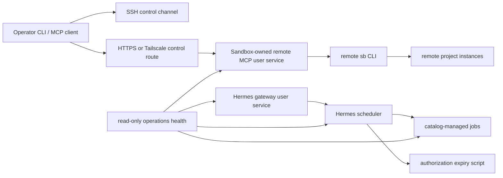

# Remote and Hermes Operations Hardening — PRD

**Status:** IMPLEMENTED LOCALLY — Phase 4 live acceptance remains pending explicit operator approval

**Prepared:** 2026-07-18

**Scope:** Registered remote control planes, Hermes gateway and scheduler services,
and their recovery paths. This document is a plan, not approval to alter a remote,
install a service, rotate a token, reconcile cron, trigger a job, or deploy code.

## 1. Outcome

Make a registered remote and its Hermes installation recoverable, observable, and
safe to operate after a reboot or failed reconciliation. The desired result is a
single read-only health view that accurately describes the remote MCP control plane,
the Hermes gateway, scheduler, catalog state, and managed worktrees; repairs remain
explicitly planned, confirmation-gated, reversible, and narrowly scoped.

The implementation must:

- keep the remote MCP server loopback-only for HTTPS transport and never bind it to
  `0.0.0.0`;
- keep the remote MCP bearer token out of command-line arguments, process listings,
  logs, returned envelopes, Git, and documentation examples;
- make the remote MCP server reboot-persistent using one Sandbox-owned systemd user
  service and owner-only credential material;
- stop only the exact service owned by the selected remote, never another
  streamable-HTTP process on the VPS;
- make Hermes gateway, linger, scheduler availability, cron catalog state, and
  managed-worktree hygiene first-class health facts;
- converge a legacy scheduler only through a reviewed plan, protected backup, exact
  replacement, post-apply verification, and bounded rollback; and
- distinguish a provider failure from an agent-result protocol failure, including a
  non-empty successful terminal result such as `COMPLETED_SPEC_TASK`.

## 2. Non-goals

- No change to WordPress or generic Compose runtime semantics.
- No public exposure of Hermes, the gateway, SSH, Docker, or the remote MCP listener.
- No replacement of Caddy, Cloudflare, Tailscale, or upstream Hermes.
- No autonomous cron enablement during implementation, tests, migration, or planning.
- No automatic production remediation, remote provisioning, token rotation, cron
  replacement, gateway restart, or job trigger.
- No migration of existing unrelated user services into Sandbox ownership.

## 3. Observed state and gap (time-bound)

The read-only review on 2026-07-18 established the following facts:

| Surface | `scaleway-sandbox` | `hermes-acceptance` |
|---|---|---|
| Remote registration / SSH | provisioned and reachable | provisioned and reachable |
| Hermes doctor | healthy | healthy |
| Gateway service | active, enabled, linger enabled | inactive, linger disabled |
| V2 gate | passed | pending |
| Scheduler | three paused legacy jobs | no jobs |
| Cron convergence | blocked without force replacement | planned creation |
| Additional health evidence | stale session and one dirty worktree | gateway ownership conflict |

On `scaleway-sandbox`, the scheduler inventory is legacy state: its three paused
jobs lack the controlled-state fingerprints required for ordinary reconciliation.
Failing closed is correct. A confirmed force replacement would create the current
catalog, but it would also enable its approved agent job; it therefore requires a
separate operator approval.

The last `sandbox-spec-backlog` run contains successful work and commits but has
`last_status: error` with `RuntimeError: COMPLETED_SPEC_TASK`. The plan must treat this
as a scheduler/terminal-result compatibility investigation, not as evidence that
provider routing is broken.

## 4. Current architecture and target architecture



### AD-001 — A systemd user unit owns remote MCP

Replace the detached `setsid` process and PID-file-only lifecycle with one unit,
`sandbox-mcp-remote.service`, under the configured remote account. The unit:

- executes the exact staged `sb mcp --transport streamable-http` runtime;
- has `Restart=on-failure`, bounded restart policy, and explicit `RestartSec`;
- uses `loginctl enable-linger` so it recovers after reboot;
- binds only to `127.0.0.1` for HTTPS or the configured Tailscale address for
  Tailscale transport;
- receives non-secret configuration in the unit and the bearer token through an
  owner-only `EnvironmentFile` (mode `0600`) or supported systemd credential;
- records the expected bind, port, runtime revision, and service name in local
  remote metadata without recording the secret; and
- is installed atomically with a retained previous unit/credential reference until
  health verification succeeds.

The MCP server parser must accept the token from the secured environment only for
the remote service path. The existing explicit CLI token option may remain for local
test compatibility, but remote lifecycle code must not use it.

### AD-002 — Ownership proof precedes stop, restart, and repair

`remote down`, `remote up`, and remote doctor must identify the service by the
Sandbox-owned unit and an immutable ownership marker. They must not enumerate and
kill processes merely because their argv contains generic FastMCP flags.

Before a mutating lifecycle operation, validate all of:

- selected remote name and provisioned metadata;
- expected systemd unit name;
- expected non-secret marker, bind address, and port;
- configured `SANDBOX_HOME` and staged runtime path; and
- service PID belongs to the selected unit.

If any proof is missing, return a non-mutating `remote_service_ownership_unknown`
error with an explicit repair plan. Never terminate a process outside the unit cgroup.

### AD-003 — Operations health is a truthful dependency graph

Extend read-only health so its top-level status is degraded when a required recovery
dependency is unavailable. Health must report each fact separately rather than
collapsing it into a generic failure.

| Component | Required evidence |
|---|---|
| Remote MCP | unit installed/enabled/active, expected listener, authenticated `/mcp` route, no unexpected public listener |
| Remote reboot recovery | user linger enabled and unit enabled |
| Hermes gateway | managed unit active/enabled, exactly one owner, legacy unit quiescent, restart count stable |
| Hermes scheduler | `hermes cron status` succeeds and is correlated with gateway ownership |
| Cron catalog | desired fingerprint, enabled state, route snapshot, script hash, and no duplicate controlled job |
| Jobs | provider/client evidence, terminal transition, result-protocol classification, and bounded output availability |
| Worktrees | dirty count, stale-session count, and managed worktree blockers |

`healthy` means every required component has current evidence. `degraded` must include
machine-readable reason codes, for example `remote_mcp_not_enabled`,
`user_linger_disabled`, `scheduler_unavailable`, `cron_drift`,
`cron_result_protocol_error`, and `dirty_managed_worktree`. `unknown` is never
silently treated as healthy.

### AD-004 — Cron reconciliation is transactional at the control-plane level

Keep the current fail-closed fingerprint rule. Add a reconciliation transaction:

1. Build a read-only exact plan; legacy or fingerprintless jobs yield `blocked`.
2. On approved force replacement, validate prerequisite repositories/worktrees before
   altering scheduler state.
3. Save an owner-only snapshot containing the prior `jobs.json`, catalog fingerprint,
   and pre-change service health evidence.
4. Install scripts atomically, replace only the scheduler inventory, and record each
   removed/created ID.
5. Re-read the scheduler and require exact fingerprint convergence plus scheduler
   availability.
6. On any failure after removal, restore the prior inventory, verify that restore,
   and return `rolled_back` or `rollback_failed` with bounded evidence.

The backup is retained for operator recovery even after a successful run. No rollback
may create, trigger, or approve an authorization request.

### AD-005 — Result protocol failures are distinct from failed work

Add a bounded terminal-result classifier for catalog agent jobs. A terminal payload
starting with the documented success markers (`COMPLETED_SPEC_TASK`,
`COMPLETED_TODO_TASK`, `NO_BACKLOG_WORK`, and `REVIEW_REQUIRED`) must be parsed before
an upstream wrapper error is classified as a work failure.

The classifier must preserve safety: an accepted marker does not override provider
authentication, malformed scheduler state, a missing terminal transition, or an
explicit failed tool/request record. It only prevents a known scheduler wrapper from
turning a valid, documented final result into a false error.

## 5. Product requirements

### Functional requirements

- `sb remote` has read-only service status/doctor evidence for every registered
  remote without emitting connection targets or secrets.
- Remote lifecycle commands are plan-first where installation, migration, restart, or
  credential-file creation is necessary; apply requires explicit confirmation.
- `sb hermes health` consumes the remote MCP service and scheduler facts where
  applicable and returns stable, machine-readable reasons.
- `sb hermes cron reconcile` returns a precise legacy-state explanation and a safe
  force-replace plan. Confirmed execution supports verified rollback.
- `sb hermes cron verify` returns separate `trigger`, `transition`, `provider`, and
  `terminal_result` evidence, never the full prompt or secret-like output.
- An operator can safely distinguish “configured but not operational”, “legacy state
  awaiting approved migration”, “failed work”, and “false scheduler result error”.

### Security and privacy requirements

- Secrets must never be passed in argv, displayed in output, retained in a unit body,
  copied into a backup, or committed.
- Credential files are owned by the remote account and mode `0600`; parent directories
  are owner-only where they contain credentials.
- Unit creation, Caddy changes, and listener changes must retain loopback/Tailscale-only
  constraints and reject wildcard/public binds.
- A stop action may affect only the selected unit and its cgroup.
- Read-only health probes must redact remote SSH details, bearer material, provider
  tokens, prompt content, and saved job output matching the existing secret screen.

## 6. Interfaces and data model

### Remote service record

Persist only non-secret fields alongside existing remote metadata:

```json
{
  "service_name": "sandbox-mcp-remote.service",
  "transport": "https",
  "bind": "127.0.0.1",
  "port": 9174,
  "runtime_revision": "<non-secret revision>",
  "ownership_marker": "<non-secret digest>"
}
```

The bearer token remains in the existing local secret store and remote credential file;
neither is copied into this record.

### Proposed read-only result shape

```json
{
  "ok": false,
  "status": "degraded",
  "reasons": ["user_linger_disabled", "cron_drift"],
  "remote_mcp": {"installed": true, "enabled": false, "active": false},
  "gateway": {"enabled": true, "active": true, "scheduler_available": true},
  "cron": {"state": "legacy_blocked", "requires_force_replace": true}
}
```

### Proposed command contracts

- `sb remote service status NAME --json`: read-only unit, listener, ownership, and
  authenticated endpoint evidence.
- `sb remote service migrate NAME --plan --json`: no-write migration plan.
- `sb remote service migrate NAME --confirm --json`: protected install/migration;
  separate operator approval required.
- `sb hermes health --remote NAME --json`: expanded read-only dependency health.
- `sb hermes cron reconcile --remote NAME --force-replace --json`: plan only.
- `sb hermes cron reconcile --remote NAME --force-replace --confirm --json`: protected
  scheduler migration and rollback-capable reconciliation.

Exact command naming remains a design decision for the feature specification; existing
commands should remain compatible where possible.

## 7. Phased delivery plan

### Phase 0 — Specify and prove current contracts

- Create a dedicated Spec-Kit feature rather than changing completed feature history.
- Capture sanitized fixtures for detached MCP, systemd MCP, legacy cron, paused jobs,
  result-protocol errors, disabled linger, and scheduler failure.
- Freeze compatibility requirements for `remote up/down`, existing remote metadata,
  local stdio MCP, and Hermes command envelopes.

### Phase 1 — Remote MCP ownership and secret transport

- Add environment-backed token loading and reject empty/mismatched source selection.
- Render/install/validate a unit atomically with non-secret ownership markers.
- Replace PID scanning with systemd unit/cgroup control.
- Add service migration plan/apply/rollback and reboot-recovery doctor checks.

### Phase 2 — Health model and Hermes service integration

- Implement a shared component-status model and reason-code contract.
- Make remote MCP, systemd enablement, linger, gateway ownership, scheduler probe, and
  cron catalog observations independently visible.
- Update `hermes health`, remote doctor, CLI output, MCP result projections, and docs.

### Phase 3 — Transactional cron reconciliation

- Add preflight, backup metadata, exact replacement, postcondition verification, and
  restore-on-failure behavior.
- Preserve the force-replace confirmation boundary.
- Add terminal-result classification and test the observed `COMPLETED_SPEC_TASK`
  wrapper-error case without approving any real job.

### Phase 4 — Controlled live remediation

This phase is intentionally separate and requires an explicit operator change window.

1. Snapshot read-only before-state for both remotes.
2. Migrate remote MCP service ownership one remote at a time; verify listener, auth,
   stop scoping, and reboot persistence before proceeding.
3. Converge the acceptance remote only if it is intended to be a recoverable target;
   otherwise explicitly mark it non-operational in inventory.
4. Review the autonomous catalog prompt and repository/worktree state.
5. If approved, force-replace `scaleway-sandbox` cron, verify exact catalog state, then
   run one bounded, explicitly approved cron verification.
6. Review worktree/session cleanup separately; never fold it into scheduler migration.

#### Partial live evidence — 2026-07-18

With explicit authorization, `scaleway-sandbox` was updated from its legacy
PID-file-managed MCP process to `sandbox-mcp-remote.service`. Read-only follow-up
verified the selected service is installed, enabled, active, owned by the expected
unit/cgroup, protected by user linger, bound only to `127.0.0.1:9174`, and accepts an
authenticated `/mcp` probe. No bearer credential, connection target, or process
arguments are recorded here.

Not performed: a scoped-stop/unrelated-process test, reboot recovery test, cron
reconciliation or verification, gateway changes, session/worktree cleanup, and any
change to `hermes-acceptance`. Those remain separately approval-gated.

## 8. Validation and acceptance matrix

| Scenario | Required result |
|---|---|
| Remote MCP starts | unit active, expected bind only, auth succeeds, no token in unit/argv/output |
| Remote MCP reboot | service returns without interactive login; doctor reports enabled + linger |
| `remote down` | only selected unit stops; unrelated streamable-HTTP fixture remains alive |
| Token exposure scan | no secret in process list, journal, result JSON, or managed metadata |
| Gateway service | one managed owner, legacy quiescent, stable restart count, scheduler probe succeeds |
| Legacy cron plan | non-mutating blocked result explains missing fingerprints |
| Confirmed cron migration failure | prior inventory restores and reports rollback evidence |
| Exact catalog convergence | desired hashes/routes/enabled state match and no duplicates remain |
| Terminal result compatibility | documented non-empty result does not become a false work failure |
| Provider failure | 401/400/429 evidence still wins over a nominal success marker |
| Health truthfulness | disabled linger, disabled unit, missing scheduler, drift, stale sessions, and dirty worktree have distinct reason codes |

Automated tests must use fakes or disposable remotes. Reboot, real remote service
installation, force replacement, and cron verification are integration acceptance steps
requiring an approved environment and explicit confirmation.

## 9. Migration, rollback, and release gates

- Preserve old PID-file behavior only as a temporary read-only detection path; do not
  let it remain an unscoped kill fallback after the new unit is present.
- Back up the old service definition and cron inventory before each confirmed migration.
- If unit activation fails, restore the previous service configuration and leave the
  old control plane untouched where possible.
- If cron replacement fails, restore the exact scheduler snapshot before returning a
  failure; if restore fails, return an urgent, bounded recovery recipe.
- Require clean implementation worktrees, passing targeted tests, documentation updates,
  and explicit human approval before any production-like Phase 4 action.
- A release cannot claim remote recovery support until reboot persistence and scoped-stop
  acceptance have been observed on a disposable remote.

## 10. Open decisions for specification

1. Choose the remote credential mechanism: systemd `EnvironmentFile` versus systemd
   credentials, based on target OS support and testability.
2. Decide whether the acceptance remote is a maintained failover candidate or an
   intentionally disposable validation target; this controls whether gateway/cron/V2
   convergence is required there.
3. Confirm the allowed terminal-result grammar for the pinned Hermes release and
   whether a Hermes upstream issue/patch is required.
4. Approve or revise the autonomous `sandbox-spec-backlog` catalog entry before any
   confirmed reconciliation enables it.
5. Select the compatibility period for PID-file detection and the migration command
   name before public CLI documentation is finalized.

## 11. Operator approvals required

The following actions remain out of scope until separately approved:

- creating or enabling remote systemd services or user lingering;
- writing, rotating, or moving bearer credentials;
- restarting or stopping gateway/MCP services;
- force-replacing either remote cron inventory;
- triggering, verifying, enabling, or routing an agent cron job;
- modifying Cloudflare, Caddy, Tailscale, DNS, firewall, or public exposure;
- cleaning dirty worktrees, cancelling stale sessions, committing, pushing, deploying,
  releasing, or changing production resources.
