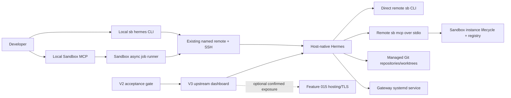

# Implementation Plan: Remote Hermes Agent Integration

**Branch**: `016-remote-hermes-agent` | **Date**: 2026-07-10 | **Spec**: [spec.md](spec.md)

**Input**: Feature specification from `specs/016-remote-hermes-agent/spec.md`

## Summary

Add a host-native Hermes control layer to Sandbox. Local `sb hermes` commands use the existing named-remote/SSH abstraction to install a signed, commit-pinned Hermes release under the remote Sandbox account, write a Sandbox-aware Hermes profile, manage repositories and worktrees, and operate gateway sessions. The remote Hermes profile launches the remote `sb mcp` process over stdio with no tool filtering and keeps direct `sb` terminal access, so Sandbox remains the sole authority for on-demand WordPress instances.

Delivery is gated in three releases:

- **V1**: pinned installation, setup/doctor/status, all Sandbox MCP tools, direct CLI, managed repositories, worktree-first chat/run, gateway lifecycle, and local Sandbox MCP controls for remote Hermes jobs.
- **V2**: update plan/apply/rollback, backup/restore, resource and concurrency limits, stale-state cleanup, structured health, log retention, and reboot recovery.
- **V3 after V2**: lifecycle management for the upstream Hermes dashboard, loopback plus SSH forwarding by default, and optional confirmed authenticated public exposure through the managed-hosting capability from feature 015.

## Technical Context

**Language/Version**: Python 3.10+ for Sandbox; shell/systemd integration on Ubuntu 24.04; Hermes-managed Python 3.11 runtime

**Primary Dependencies**: Python standard library, existing Sandbox remote SSH helpers, existing host-level asynchronous job runner, Git worktrees, systemd, upstream Hermes installer and CLI; V3 optionally reuses Sandbox hosting/Caddy/Cloudflare modules

**Storage**: Local non-secret defaults in `sandbox.local.yml`; remote integration state in `$SANDBOX_HOME/runtime/hermes.json`; remote Hermes state in `$HOME/.hermes`; managed repositories in `$SANDBOX_HOME/hermes-repos`; existing WordPress instance state remains in `$SANDBOX_HOME/runtime/registry.json`

**Testing**: `unittest` with mocked SSH/subprocess/filesystem boundaries, CLI contract tests, MCP tool tests, disposable local Git repositories, remote smoke test on `scaleway-sandbox`, and staged fault-injection/reboot acceptance tests for V2/V3

**Target Platform**: Existing provisioned Linux Sandbox remotes; first certified host is Ubuntu 24.04 x86_64 with systemd and Docker

**Project Type**: CLI, MCP tools, and remote service orchestration

**Performance Goals**: Status in 10 seconds on a reachable remote; installation/update bounded to 30 minutes; synchronous prompt bounded by explicit timeout; asynchronous output reads capped at 1 MiB per poll; instance operations retain existing Sandbox timeouts

**Constraints**: No secret output; no embedded Git credentials; no implicit production/DNS mutation; no automatic dirty-worktree deletion; no moving-branch install/update; complete unfiltered Sandbox MCP access is intentional; dashboard implementation is blocked until V2 acceptance passes

**Scale/Scope**: One developer-owned remote, dozens of managed repositories, a configurable small number of concurrent Hermes sessions/worktrees, one gateway per Hermes profile, and one V3 dashboard service

## Constitution Check

*GATE: Must pass before Phase 0 research. Re-checked after Phase 1 design.*

| Principle | Status | Design evidence |
|---|---|---|
| Per-project instance model | Pass | Hermes passes a canonical repository/worktree `project_dir` to `ensure_instance`; it never invents instance names. |
| Registry authority | Pass | WordPress instances remain exclusively in the existing remote `registry.json`; `hermes.json` stores only Hermes/repository/session metadata. |
| Single `sb` entry and modularity | Pass | Public parsing stays in `sandbox/cli.py`; orchestration is split into `sandbox/commands/hermes.py` and `sandbox/core/_hermes.py`. |
| MCP and CLI verification | Pass | Contract/unit tests are followed by live `hermes doctor`, MCP catalog comparison, direct `sb`, worktree, and instance smoke tests. |
| Idempotency and docs | Pass | Install/setup/service commands converge; V1 documentation lands with the commands and V2/V3 extend it with their release. |
| Least privilege and secret handling | Pass with recorded residual risk | Hermes shares only the existing Sandbox user/Docker rights. Full unfiltered MCP was explicitly requested and is documented as a high-trust boundary. |
| Human approval gates | Pass | No commit, push, release, DNS, public exposure, secret provisioning, or production change is part of unattended implementation. |
| User-change preservation | Pass | Worktree-first sessions and dirty-worktree refusal protect primary and active checkouts. |

**Post-design re-check**: The entities, contracts, and quickstart below preserve the same gates. The only elevated surface is the requested complete Sandbox MCP catalog; manual shell approval does not secure arbitrary MCP calls, so the remote account/profile remains a trusted single-operator boundary and destructive actions require explicit policy confirmation.

## Architecture



### Control boundaries

1. The **local control plane** selects a configured remote and transports bounded commands over the existing SSH helpers.
2. The **remote Hermes runtime** uses the real remote user home, allowing Git/provider credentials to remain scoped to that account.
3. The **Sandbox data plane** is the remote `sb` CLI/MCP process. Hermes receives all tools, but WordPress lifecycle and registry rules remain unchanged.
4. The **repository plane** accepts only validated managed names and canonical paths beneath `$SANDBOX_HOME/hermes-repos`; repository mutations use per-repository locks.
5. The **service plane** wraps upstream gateway/dashboard processes in systemd units with generated environment files and no secrets in unit text.
6. The **public exposure plane** does not exist in V1/V2. V3 may call feature 015 only after an explicit plan and confirmation.

## Release Gates

| Gate | Required evidence | Unlocks |
|---|---|---|
| V1 core | Unit/contract suite, clean remote install, idempotent reinstall, full MCP catalog comparison, direct CLI probe, two isolated worktrees, on-demand instance smoke, restrictive gateway smoke | V2 hardening work |
| V2 operations | Update preview/confirm, injected update rollback, backup/restore, limit rejection, stale-state reconciliation, log rotation, structured health, reboot recovery on supported remote | V3 dashboard implementation |
| V3 dashboard | Gate refusal before V2, authenticated SSH-forwarded access after V2, no public listener by default, public exposure plan/confirm/rollback test where feature 015 is available | Optional dashboard release/exposure |

Gate evidence is stored as non-secret structured acceptance records in `$SANDBOX_HOME/runtime/hermes.json`; the implementation never self-certifies a gate from a version string alone.

## Project Structure

### Documentation (this feature)

```text
specs/016-remote-hermes-agent/
├── spec.md
├── plan.md
├── research.md
├── data-model.md
├── quickstart.md
├── contracts/
│   ├── cli.md
│   ├── mcp.md
│   └── services-and-dashboard.md
├── checklists/
│   └── requirements.md
└── tasks.md
```

### Source Code (repository root)

```text
sandbox/
├── cli.py                         # argparse surface and command import
├── commands/
│   └── hermes.py                  # CLI dispatch, human/JSON presentation
└── core/
    ├── __init__.py                # lazy core export registration
    ├── _asyncjobs.py              # existing detached job substrate, bounded polling
    └── _hermes.py                 # validation, SSH orchestration, state, config, services

mcp/wp-server/
├── server.py                      # Hermes tool-group registration
└── tools/
    └── hermes.py                  # hermes_status and hermes_run tools

tests/
├── test_hermes.py                 # core, repository, service, update, dashboard tests
├── test_cli.py                    # parser/dispatch/JSON contract additions
└── test_mcp.py                    # tool registration and async response additions

docs/
└── hermes-agent.md                # operator guide and trust boundary
```

**Structure Decision**: Extend the current single Python CLI/MCP project. Keep SSH-safe command construction, state transitions, locks, config generation, and service rendering in `_hermes.py`; keep UI/exit behavior in the command module; expose only thin validated MCP wrappers. Do not create a new daemon or duplicate Sandbox's instance registry.

## Implementation Strategy

### V1 — Core integration

1. Add typed validation helpers and the `hermes` state schema with atomic writes and restrictive permissions.
2. Add remote capability preflight and a pinned installer flow using the upstream installer with `--branch`, `--commit`, `--skip-setup`, `--non-interactive`, and explicit home/install paths.
3. Render the Hermes profile with local terminal backend, real home, manual approvals, checkpoints, and a stdio `sandbox` MCP server invoking the absolute remote `sb mcp` path. Disable MCP parallel calls because Sandbox tools share registries, files, databases, and containers.
4. Implement CLI install/setup/doctor/status/chat/run and stable JSON envelopes.
5. Implement managed Git authentication/clone/list and worktree-first session launch. Use upstream `hermes -w` only after validating that its `.worktrees` behavior meets retention rules; otherwise create the branch/worktree in Sandbox and invoke Hermes inside it.
6. Add restrictive gateway service management and bounded logs.
7. Add local Sandbox MCP status/run operations using the existing detached job system.

### V2 — Hardening

1. Store current and target immutable revisions, create integrity-checked backups, render a read-only update plan, and require confirmation.
2. Stop affected services, update, run health checks, and restore the backup automatically on failure.
3. Add configurable job/worktree/disk/memory limits and per-home/per-repository locks.
4. Add dry-run cleanup, conservative stale reconciliation, log rotation, and systemd recovery checks.
5. Execute and record the V2 live acceptance gate; do not add a manual bypass that marks the gate passed.

### V3 — Dashboard after V2

1. Reject all dashboard commands unless the V2 acceptance record matches the current supported integration schema and Hermes revision.
2. Install the upstream `[web,pty]` support for the pinned release and manage `hermes dashboard --host 127.0.0.1 --no-open --tui` as a dedicated service.
3. Treat SSH authentication plus loopback binding as the default authenticated access boundary. Never invoke `--insecure`.
4. For public access, require upstream OAuth configuration, explicit FQDN, feature 015 availability, a read-only route plan, and `--confirm`; rollback routing when health/auth checks fail.
5. Keep the dashboard as an upstream surface; Sandbox adds lifecycle, gating, diagnostics, and exposure orchestration only.

## Verification Plan

### Automated

- Parse every new CLI form and assert confirmation/gate failures occur before SSH.
- Test canonical-path containment, URL credential rejection, name normalization, locking, dirty worktree retention, and JSON redaction.
- Snapshot generated Hermes YAML/systemd/environment content and assert no secret values enter config or output.
- Mock installer checksum/tag/commit verification, partial install recovery, service errors, timeouts, update rollback, backup restore, and gate records.
- Compare registered MCP tool names and assert `supports_parallel_tool_calls: false` with no include/exclude restriction.
- Test output truncation, cancellation, and orphan reconciliation through the existing asynchronous job contract.
- Test loopback dashboard command rendering, V2 gate refusal, `--insecure` rejection, confirmed expose/unexpose, and failed-exposure rollback.

### Live remote (requires current human approval before credential or external actions)

- Run status/preflight against `scaleway-sandbox`.
- Install the pinned signed release and verify the resolved full commit.
- Configure a non-secret test provider/profile or pause for operator-owned provider authentication.
- Compare the remote `sb mcp` catalog with Hermes-discovered Sandbox tools and probe direct `sb` execution.
- Clone a disposable repository, start two worktree sessions, and verify the primary checkout is unchanged.
- Initialize a disposable WordPress project/worktree, call `ensure_instance`, probe its URL, then retain or destroy it only with explicit approval.
- Install a restrictive test gateway and verify start/status/restart/logs without opening public access.
- V2/V3 live acceptance runs occur only in their respective implementation milestones.

## Rollback

- **V1 install/setup**: stop Hermes services, restore the prior config backup, and remove only integration-owned files recorded in `hermes.json`; managed repositories and WordPress instances remain untouched.
- **Repository/session**: stop the session and retain dirty worktrees. Clean worktrees are removed only by a confirmed cleanup action.
- **V2 update/restore**: restore the pre-update installation/config backup and restart only services that were previously active.
- **V3 dashboard**: stop/disable its service, restore prior managed routing, and retain Hermes CLI/gateway functionality.

## Complexity Tracking

| Violation | Why Needed | Simpler Alternative Rejected Because |
|---|---|---|
| Trusted full MCP capability instead of least-privilege filtering | The user explicitly requires Hermes to have every Sandbox tool and CLI operation. | Filtering destructive tools would fail the primary requirement; the residual risk is documented and constrained to the trusted remote account/profile. |
| Separate `hermes.json` runtime state | Hermes repositories, jobs, backups, services, and version gates are not WordPress instances. | Adding them to `registry.json` would weaken the existing instance registry's single-purpose authority. |
