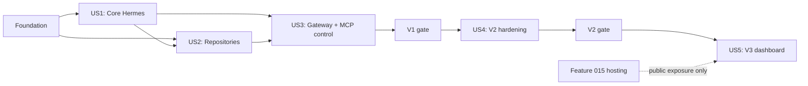

# Tasks: Remote Hermes Agent Integration

**Input**: Design documents from `specs/016-remote-hermes-agent/`

**Prerequisites**: [plan.md](plan.md), [spec.md](spec.md), [research.md](research.md), [data-model.md](data-model.md), [contracts/](contracts/), [quickstart.md](quickstart.md)

**Tests**: Required by the specification and release gates. Story tests are written before implementation where practical and must fail for the missing behavior before the corresponding code task begins.

**Organization**: Tasks are grouped by user story. V1 comprises US1-US3, V2 is US4, and V3 is US5. V3 implementation is blocked until the V2 live acceptance record passes.

## Format: `[ID] [P?] [Story?] Description`

- **[P]**: Can run in parallel because it targets a different file and does not depend on an incomplete task in the same phase.
- **[Story]**: Maps the task to a user story in [spec.md](spec.md).
- Every task names the exact file it creates, changes, or validates.

## Phase 1: Setup and Compatibility Baseline

**Purpose**: Establish upstream compatibility evidence, configuration defaults, and test fixtures before adding a public command.

- [X] T001 Record the supported Hermes tag, resolved full commit, installer flags, config keys, gateway commands, and dashboard flags in `sandbox/core/_hermes.py`
- [X] T002 [P] Add non-secret Hermes defaults and documented override keys to `docs/sandbox-config-reference.md`
- [X] T003 [P] Add reusable fake remote, fake Hermes installer, and disposable Git repository fixtures to `tests/fixtures/hermes.py`
- [X] T004 [P] Add Hermes command import and parser smoke expectations to `tests/test_cli.py`

---

## Phase 2: Foundational State, Validation, and Remote Execution

**Purpose**: Create the safe shared substrate used by every story.

**CRITICAL**: No story implementation starts until this phase passes focused tests.

- [X] T005 Implement Hermes state schema, restrictive permissions, migrations, locking, and atomic writes in `sandbox/core/_hermes.py`
- [X] T006 Implement remote resolution, capability preflight, absolute Sandbox/Hermes path discovery, and redacted SSH execution wrappers in `sandbox/core/_hermes.py`
- [X] T007 Implement managed-name, canonical-path containment, repository URL, immutable revision, port, timeout, and confirmation validators in `sandbox/core/_hermes.py`
- [X] T008 Implement the stable human/JSON result envelope and structured sanitized errors in `sandbox/commands/hermes.py`
- [X] T009 Register Hermes core exports and command-module loading in `sandbox/core/__init__.py` and `sandbox/cli.py`
- [X] T010 Add focused tests for state migration, atomicity, permissions, locks, validation, timeouts, and redaction in `tests/test_hermes.py`

**Checkpoint**: State and SSH helpers reject unsafe inputs before remote mutation and emit no secrets.

---

## Phase 3: User Story 1 — Install and Initiate Remote Hermes (Priority: P1, V1 MVP)

**Goal**: Reproducibly install a pinned Hermes revision, configure complete Sandbox CLI/MCP access, diagnose it, run a prompt, and create a WordPress instance on demand.

**Independent Test**: Starting from a supported remote without Hermes, install twice, set up a profile, run diagnostics, execute a read-only prompt, compare the complete MCP catalog, and call `ensure_instance` for a disposable WordPress worktree.

### Tests for User Story 1

- [X] T011 [P] [US1] Add CLI contract tests for install, setup, doctor, status, chat, run, immutable revision mismatch, and JSON output in `tests/test_cli.py`
- [X] T012 [P] [US1] Add generated Hermes YAML snapshot tests for direct `sb`, complete stdio MCP discovery, sequential calls, approvals, checkpoints, and secret exclusion in `tests/test_hermes.py`
- [X] T013 [P] [US1] Add mocked remote tests for clean install, identical reinstall, partial-install recovery, setup preservation, catalog mismatch, and direct CLI failure in `tests/test_hermes.py`
- [X] T014 [P] [US1] Add MCP/instance integration assertions for `ensure_instance` reuse by canonical worktree and no implicit non-WordPress instance in `tests/test_mcp.py`

### Implementation for User Story 1

- [X] T015 [US1] Implement signed-tag/full-commit resolution and official non-interactive installer orchestration in `sandbox/core/_hermes.py`
- [X] T016 [US1] Implement integration-owned Hermes profile merge, backup, file-permission checks, and Sandbox stdio MCP rendering in `sandbox/core/_hermes.py`
- [X] T017 [US1] Implement direct `sb`, MCP initialize/catalog, release, path, Docker, disk, memory, and configuration diagnostic probes in `sandbox/core/_hermes.py`
- [X] T018 [US1] Implement install, setup, doctor, and status CLI dispatch and output in `sandbox/commands/hermes.py`
- [X] T019 [US1] Implement interactive chat and synchronous/async one-shot launch with bounded prompt/result handling in `sandbox/core/_hermes.py`
- [X] T020 [US1] Add `hermes install|setup|doctor|status|chat|run` argument trees and confirmation-safe defaults in `sandbox/cli.py`
- [X] T021 [US1] Add the full-access trust boundary, `ensure_instance`-first workflow, and non-WordPress behavior to `docs/hermes-agent.md`
- [X] T022 [US1] Run focused V1 tests and record exact commands/results in `specs/016-remote-hermes-agent/quickstart.md`
- [ ] T023 [US1] Execute the approved clean-install/idempotency/MCP/direct-CLI/on-demand-instance smoke and record sanitized V1 gate evidence through `$SANDBOX_HOME/runtime/hermes.json`

**Checkpoint**: US1 alone delivers a usable remote Hermes installation with direct Sandbox CLI, the full Sandbox MCP catalog, and on-demand instance access.

---

## Phase 4: User Story 2 — Work Safely on Any Git Repository (Priority: P2, V1)

**Goal**: Authenticate, clone, list, and select any authorized Git repository while isolating coding sessions in worktrees by default.

**Independent Test**: Clone public/private disposable repositories, reject unsafe names/URLs, start two sessions with distinct worktrees, and prove a dirty primary checkout is unchanged.

### Tests for User Story 2

- [X] T024 [P] [US2] Add repository auth/clone/list CLI contract and JSON redaction tests in `tests/test_cli.py`
- [X] T025 [P] [US2] Add repository URL, temporary clone, canonical rename, duplicate origin, provider failure, submodule, and Git LFS tests in `tests/test_hermes.py`
- [X] T026 [P] [US2] Add worktree branch collision, concurrent lock, dirty retention, cleanup refusal, and no-worktree override tests in `tests/test_hermes.py`

### Implementation for User Story 2

- [X] T027 [US2] Implement provider device-auth launch and authentication-status probing without token output in `sandbox/core/_hermes.py`
- [X] T028 [US2] Implement atomic managed clone, sanitized origin storage, repository verification, and repository listing in `sandbox/core/_hermes.py`
- [X] T029 [US2] Implement per-repository locks and worktree-first session creation with collision-resistant branches in `sandbox/core/_hermes.py`
- [X] T030 [US2] Implement conservative session completion metadata and dirty/active worktree retention in `sandbox/core/_hermes.py`
- [X] T031 [US2] Implement `hermes repo auth|clone|list` and worktree/no-worktree presentation in `sandbox/commands/hermes.py`
- [X] T032 [US2] Add repository subcommands, URL/name/ref options, and explicit `--no-worktree` parsing in `sandbox/cli.py`
- [X] T033 [US2] Document provider authentication, managed repository rules, concurrent worktrees, retention, and recovery in `docs/hermes-agent.md`

**Checkpoint**: US2 supports general Git work without changing a dirty primary checkout.

---

## Phase 5: User Story 3 — Operate Long-Running Hermes Access (Priority: P3, V1)

**Goal**: Manage a restrictive persistent gateway and initiate/poll/cancel remote Hermes prompts through Sandbox MCP.

**Independent Test**: Reject unsafe gateway policies, install/start/restart/stop a safe service, submit an async MCP prompt, poll bounded output, cancel it, and reconcile its process group.

### Tests for User Story 3

- [X] T034 [P] [US3] Add gateway service rendering, unsafe allowlist, idempotent lifecycle, reboot-start, and bounded log tests in `tests/test_hermes.py`
- [X] T035 [P] [US3] Add `hermes_status` and `hermes_run` registration, validation, sync/async, cancellation, timeout, and redaction tests in `tests/test_mcp.py`
- [X] T036 [P] [US3] Add gateway and Hermes async CLI parser/JSON contract tests in `tests/test_cli.py`

### Implementation for User Story 3

- [X] T037 [US3] Implement allowlist validation, profile-scoped systemd unit rendering, service observation, bounded journald reads, and rollback in `sandbox/core/_hermes.py`
- [X] T038 [US3] Implement gateway setup/install/start/stop/restart/status/logs dispatch in `sandbox/commands/hermes.py`
- [X] T039 [US3] Add gateway lifecycle argument trees and bounded log options in `sandbox/cli.py`
- [X] T040 [US3] Implement thin validated `hermes_status` and `hermes_run` tools using shared orchestration and the existing async job runner in `mcp/wp-server/tools/hermes.py`
- [X] T041 [US3] Register the Hermes MCP tool group and preserve catalog initialization behavior in `mcp/wp-server/server.py`
- [X] T042 [US3] Document gateway pairing/allowlists, MCP job polling/cancellation, output limits, and reboot expectations in `docs/hermes-agent.md`

**Checkpoint**: V1 is complete when US1-US3 automated and approved live gate evidence passes.

---

## Phase 6: User Story 4 — Update, Recover, and Operate Reliably (Priority: P4, V2)

**Goal**: Add immutable update/rollback, backup/restore, resource controls, cleanup, health, and reboot recovery, then record a real V2 acceptance gate.

**Independent Test**: Preview and apply a pinned update, inject health failure and observe rollback, restore a verified backup, exceed each configured limit, reconcile stale state, rotate logs, and reboot the supported remote.

### Tests for User Story 4

- [X] T043 [P] [US4] Add immutable update plan/confirm, moving-branch rejection, backup preflight, health failure, and automatic rollback tests in `tests/test_hermes.py`
- [X] T044 [P] [US4] Add backup digest, compatibility, disk-space, pre-restore backup, restore rollback, and retention tests in `tests/test_hermes.py`
- [X] T045 [P] [US4] Add concurrent job/worktree, disk/memory threshold, lock timeout, queue/refusal, and bounded retention tests in `tests/test_hermes.py`
- [X] T046 [P] [US4] Add stale PID/job/worktree, dirty ambiguity, dry-run cleanup, log rotation, service recovery, and acceptance-record invalidation tests in `tests/test_hermes.py`
- [X] T047 [P] [US4] Add update/backup/cleanup/health/acceptance CLI contract and confirmation-before-SSH tests in `tests/test_cli.py`

### Implementation for User Story 4

- [X] T048 [US4] Implement integrity-checked backup creation/listing/retention and compatibility-validated restore in `sandbox/core/_hermes.py`
- [X] T049 [US4] Implement immutable update planning, confirmation, service quiescing, install verification, health checks, and automatic rollback in `sandbox/core/_hermes.py`
- [X] T050 [US4] Implement configurable job/worktree/disk/memory resource policy and preflight enforcement in `sandbox/core/_hermes.py`
- [X] T051 [US4] Implement conservative stale job/worktree reconciliation, dry-run cleanup, and completed artifact retention in `sandbox/core/_hermes.py`
- [X] T052 [US4] Implement structured health aggregation, log rotation configuration, reboot recovery checks, and revision-specific acceptance records in `sandbox/core/_hermes.py`
- [X] T053 [US4] Implement update plan/apply, backup create/list/restore, cleanup, health, and V2 acceptance dispatch in `sandbox/commands/hermes.py`
- [X] T054 [US4] Add V2 argument trees with explicit `--confirm`, default dry-run, and JSON options in `sandbox/cli.py`
- [X] T055 [US4] Document V2 update, rollback, restore, resource configuration, cleanup, health, and recovery procedures in `docs/hermes-agent.md`
- [X] T056 [US4] Add the V2 fault-injection and reboot acceptance procedure to `specs/016-remote-hermes-agent/quickstart.md`
- [ ] T057 [US4] Execute the separately approved V2 live acceptance suite and record revision-specific sanitized evidence through `$SANDBOX_HOME/runtime/hermes.json`

**Checkpoint**: V3 remains locked unless T057 records an actual passing V2 gate for compatible Hermes/Sandbox revisions.

---

## Phase 7: User Story 5 — Authenticated Web Dashboard (Priority: P5, V3 after V2)

**Goal**: Manage the upstream Hermes dashboard on loopback after V2, provide SSH-forwarded access, and optionally expose it through authenticated managed TLS routing with rollback.

**Independent Test**: Prove all commands refuse before V2, install/start after V2, access over SSH forwarding with no public listener, and inject a public exposure failure that restores prior routing with no unauthenticated endpoint.

### Tests for User Story 5

- [X] T058 [P] [US5] Add universal V2-gate refusal, stale-gate invalidation, and no-mutation dashboard tests in `tests/test_hermes.py`
- [ ] T059 [P] [US5] Add upstream web/PTY dependency, loopback command, port conflict, same-profile, systemd lifecycle, health, and `--insecure` rejection tests in `tests/test_hermes.py`
- [ ] T060 [P] [US5] Add dashboard lifecycle/expose/unexpose parser, plan, confirmation-before-SSH, and JSON contract tests in `tests/test_cli.py`
- [ ] T061 [P] [US5] Add feature-015 dependency, FQDN, OAuth preflight, TLS route, unauthenticated rejection, authenticated health, and rollback tests in `tests/test_hermes.py`

### Implementation for User Story 5

- [X] T062 [US5] Implement mandatory current V2 gate evaluation for every dashboard operation in `sandbox/core/_hermes.py`
- [ ] T063 [US5] Implement pinned upstream web/PTY dependency installation and loopback dashboard systemd unit rendering in `sandbox/core/_hermes.py`
- [ ] T064 [US5] Implement dashboard setup/start/stop/restart/status/logs/doctor state and bounded health probes in `sandbox/core/_hermes.py`
- [ ] T065 [US5] Implement SSH-forward access instructions without credential or raw target leakage in `sandbox/commands/hermes.py`
- [ ] T066 [US5] Implement read-only public exposure planning, OAuth/TLS preflight, confirmed apply/unexpose, authenticated health, and managed-hosting rollback in `sandbox/core/_hermes.py`
- [ ] T067 [US5] Implement dashboard install/setup/lifecycle/doctor/expose/unexpose dispatch in `sandbox/commands/hermes.py`
- [ ] T068 [US5] Add V3 dashboard argument trees without an insecure bypass in `sandbox/cli.py`
- [ ] T069 [US5] Document upstream dashboard scope, V2 gate, SSH forwarding, OAuth public mode, exposure confirmation, and rollback in `docs/hermes-agent.md`
- [ ] T070 [US5] Execute the separately approved V3 loopback and optional public rollback acceptance procedure from `specs/016-remote-hermes-agent/quickstart.md`

**Checkpoint**: V3 is complete only when default access is loopback/SSH-authenticated, public access is OAuth/TLS-authenticated, and failed exposure leaves no unauthenticated endpoint.

---

## Phase 8: Polish and Cross-Cutting Verification

**Purpose**: Finish documentation, compatibility, regression, security review, and the repository-required work trace.

- [X] T071 [P] Add the Hermes quick-start entry and roadmap links to `README.md`
- [X] T072 [P] Add durable Hermes operating/reflex rules only where justified by implementation evidence in `AGENTS.md`
- [X] T073 Add full-catalog MCP, Docker-equivalent privilege, Git credential, prompt-history, gateway, OAuth, and public exposure threat-model findings to `docs/hermes-agent.md`
- [X] T074 Run focused and full unit suites plus `git diff --check`, and record exact results in `specs/016-remote-hermes-agent/quickstart.md`
- [ ] T075 Perform an independent security/data/API simplicity review and record findings/resolutions in `specs/016-remote-hermes-agent/checklists/implementation-review.md`
- [X] T076 Record task class, model/effort, scope, retries, commands, test/review evidence, outcome, residual risk, and learning delta in `tmp/task-traces/016-remote-hermes-agent.md`
- [X] T080 [US2] Keep managed worktrees in the integration-owned runtime root, count only their roots for resource policy, preserve legacy cleanup, and prove the primary checkout remains clean in `sandbox/core/_hermes.py`, `tests/test_hermes.py`, and `docs/hermes-agent.md`
- [X] T081 [US2] Replace broad GitHub browser OAuth with an explicit fine-grained repository-token stdin flow, reject broad OAuth before remote mutation, use HTTPS Git, and document/test the no-token-leak contract in `sandbox/cli.py`, `sandbox/commands/hermes.py`, `tests/test_hermes.py`, `tests/test_cli.py`, `docs/hermes-agent.md`, and `specs/016-remote-hermes-agent/contracts/cli.md`

---

## Dependencies and Execution Order

### Phase Dependencies

- **Setup (Phase 1)**: Starts immediately.
- **Foundation (Phase 2)**: Depends on Setup and blocks every user story.
- **US1 (Phase 3)**: Depends on Foundation; this is the V1 MVP.
- **US2 (Phase 4)**: Core repository helpers can begin after Foundation, but final session integration depends on US1 launch/config behavior.
- **US3 (Phase 5)**: Depends on US1 and the managed repository/session behavior from US2; completing US1-US3 unlocks V2.
- **US4 (Phase 6)**: Depends on a passing V1 core gate; its live acceptance record unlocks V3.
- **US5 (Phase 7)**: Depends on a current passing V2 gate. Public exposure also depends on feature 015 managed-hosting plan/apply/rollback support.
- **Polish (Phase 8)**: Runs after the targeted release scope; V1 may complete polish before V2/V3 are scheduled, then repeat affected checks in later milestones.

### User Story Dependency Graph



### Within Each User Story

1. Add contract/failure tests and observe the relevant missing behavior fail.
2. Implement core state/orchestration before command or MCP presentation.
3. Implement parser/registration after shared behavior exists.
4. Update documentation with the same release's code.
5. Run focused tests, then the full regression suite.
6. Perform live remote acceptance only with current authorization for credentials, instances, services, reboot, DNS, or public exposure.

## Parallel Opportunities

- T002-T004 can proceed independently after T001 establishes the compatibility baseline.
- Story-specific CLI, core snapshot, and MCP tests marked [P] target separate files or independent test sections.
- US1 config snapshot tests (T012), remote orchestration tests (T013), and instance/MCP tests (T014) can be prepared concurrently.
- US2 repository tests (T025) and worktree tests (T026) are independent before implementation converges in `_hermes.py`.
- US3 gateway tests (T034), MCP tests (T035), and CLI tests (T036) can be authored concurrently.
- V2 update (T043), backup (T044), resource (T045), stale/recovery (T046), and CLI (T047) test sets are independent.
- V3 gate (T058), service (T059), CLI (T060), and public exposure (T061) tests are independent.
- Documentation tasks can proceed in parallel only after their corresponding contracts are stable; no parallel writers should overlap `sandbox/core/_hermes.py`.

## Parallel Examples

### US1

```text
T012: Generated Hermes profile and MCP snapshot tests in tests/test_hermes.py
T014: Instance lifecycle integration assertions in tests/test_mcp.py
```

### US3

```text
T034: Gateway service tests in tests/test_hermes.py
T035: Hermes MCP tool tests in tests/test_mcp.py
T036: Gateway/async parser tests in tests/test_cli.py
```

### US5

```text
T058: V2 gate tests in tests/test_hermes.py
T060: Dashboard CLI tests in tests/test_cli.py
T061: Managed-hosting/OAuth/rollback tests in tests/test_hermes.py after coordinating non-overlapping sections
```

## Implementation Strategy

### MVP First — US1

1. Complete Setup and Foundation.
2. Complete US1 tests and implementation.
3. Stop and validate pinned install, full Sandbox access, direct CLI, and one on-demand instance.
4. Do not add gateway, update, or dashboard complexity until this slice is proven.

### V1 Increment

1. Add US2 managed repositories and worktree isolation.
2. Add US3 gateway and MCP initiation.
3. Run the V1 core gate and finish V1 documentation/review.

### V2 Increment

1. Add update/backup/resource/recovery controls from US4.
2. Run fault injection and live reboot acceptance.
3. Record a gate from evidence; do not mark it passed manually.

### V3 Increment

1. Verify the V2 gate refuses stale or absent evidence.
2. Add upstream loopback dashboard lifecycle and SSH-forwarded access.
3. Add optional authenticated public exposure only after feature 015 is available.
4. Prove rollback leaves no unauthenticated public endpoint.

## Task Summary

- **Total tasks**: 76
- **Setup/Foundation**: 10
- **US1**: 13
- **US2**: 10
- **US3**: 9
- **US4**: 15
- **US5**: 13
- **Polish**: 6
- **Suggested MVP**: Setup + Foundation + US1 (T001-T023)

## Phase 9: Convergence

- [X] T077 Persist the resolved absolute `SANDBOX_HOME` in the effective Hermes `mcp_servers.sandbox.env` configuration and preserve unrelated Hermes config during setup per FR-004 and FR-005 (partial)
- [X] T078 Prove diagnostics validate the effective unfiltered Sandbox MCP configuration, including tools, resources, prompts, sequential execution, and the resolved `SANDBOX_HOME`, per FR-004 and FR-006 (partial)

## Phase 10: Convergence

- [X] T079 Validate the scoped effective `mcp_servers.sandbox` configuration without emitting configuration contents, rejecting missing resolved paths, parallel calls, disabled resources/prompts, and include/exclude filters per FR-004 and FR-006 (partial)
