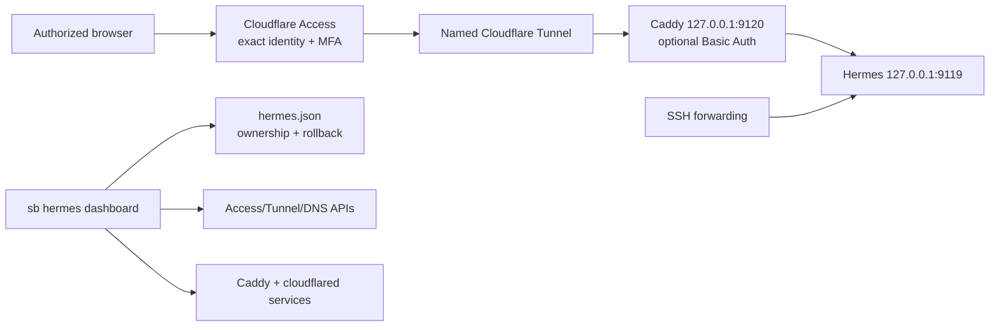

# Implementation Plan: Hermes Public Dashboard Access

**Branch**: `019-hermes-public-access` | **Date**: 2026-07-12 | **Spec**: [spec.md](spec.md)

**Input**: Feature specification from `specs/019-hermes-public-access/spec.md`

## Summary

Extend the existing loopback-only Hermes dashboard with an optional, confirmation-gated
public route at `hermes.asb.bd`. Cloudflare Access is the primary identity boundary;
a remotely managed Cloudflare Tunnel is the only public transport; Caddy is a dedicated
loopback-only inner proxy to Hermes and may add an opt-in Basic Auth verifier. The
feature reuses existing named-remote SSH, Hermes state, Cloudflare request, Caddy
validation, redaction, and rollback patterns without changing the WordPress registry
or adding public Sandbox MCP operations.

## Technical Context

**Language/Version**: Python 3.10+; shell/systemd operations on the supported Ubuntu 24.04 remote

**Primary Dependencies**: Python standard library; existing named-remote SSH helpers;
existing Hermes dashboard/V2 gate; Cloudflare REST API; remotely managed `cloudflared`;
host Caddy

**Storage**: Local personal secret file references; remote
`$SANDBOX_HOME/runtime/hermes.json`; remote Caddy fragment and root-owned optional
password-verifier file; remote user-service credential file. No credential value is
stored in Git or public result state.

**Testing**: `unittest` with mocked Cloudflare HTTP and SSH boundaries; CLI parser and
result-envelope tests; generated Caddy/systemd snapshot tests; existing full test suite;
separately approved live remote/edge acceptance.

**Target Platform**: Existing `scaleway-sandbox` Ubuntu 24.04 x86_64 remote with
systemd, Caddy, and a current loopback Hermes dashboard.

**Project Type**: CLI and remote-service orchestration.

**Performance Goals**: Read-only plan and status return in 15 seconds on a reachable
remote; local proxy/connector health checks are bounded; no dashboard endpoint is
exposed before all preflights pass.

**Constraints**: Exact `hermes.asb.bd` only; current V2 gate required; Cloudflare Access
is deny-by-default with MFA; `cloudflared` routes only to `127.0.0.1:9120`; Hermes
stays on `127.0.0.1:9119`; no `--insecure`; no secret output; no implicit external
mutation; apply/unexpose require `--confirm`; only integration-owned resources may be
modified or removed.

**Scale/Scope**: One trusted operator, one remote, one hostname, one dashboard, one
tunnel route, and optional one Basic Auth verifier. Multi-operator policy management,
arbitrary hostnames, public Sandbox MCP, and public gateway/SSH are out of scope.

## Constitution Check

| Principle | Status | Design evidence |
|---|---|---|
| Per-project instance model | Pass | The feature does not create, resolve, or store WordPress instances. |
| Registry authority | Pass | Public-exposure state remains in `hermes.json`, not the WordPress registry. |
| Single `sb` entry and modularity | Pass | Parsing stays in `sandbox/cli.py`; focused logic lives in importable core modules. |
| Live-stack verification | Pass with gate | Unit/contract tests are necessary; completion requires separately approved live remote and edge acceptance. |
| Idempotency and docs-with-code | Pass | Desired-state planning, ownership checks, atomic remote writes, rollback records, and operator documentation ship together. |
| Human approval gates | Pass | Every route, DNS, Access, service, and credential mutation requires an explicit current confirmation. |
| Secret handling | Pass | Tokens/passwords are read from approved secret sources and never serialized into result envelopes, state, arguments, or Git. |

**Post-design re-check**: No constitution exceptions are required. The only elevated
surface is the existing trusted Hermes account, which remains loopback-only; Cloudflare
Access and the tunnel reduce rather than broaden direct network reachability.

## Architecture



### Control boundaries

1. **Operator CLI**: the only interface that can plan, publish, rotate, or remove
   public access. MCP can expose status only.
2. **Cloudflare Access**: authenticates exact approved identities and MFA before any
   request is routed.
3. **Tunnel**: makes outbound connector traffic the only public transport; the Hermes
   origin has no public listener.
4. **Caddy**: listens only on `127.0.0.1:9120`, proxies only to dashboard loopback,
   and optionally enforces a pre-hashed secondary credential.
5. **Hermes**: stays on `127.0.0.1:9119`; its existing doctor continues to reject
   public binds.
6. **State and rollback**: records non-secret ownership IDs, previous fragment content,
   previous DNS record, service state, and target revisions for one apply attempt.

## Architecture Decisions

### AD-001 — Use Access plus Tunnel, not public Caddy ingress

Cloudflare Tunnel avoids an internet-reachable Hermes origin and supports WebSockets.
Cloudflare Access is created or attached before the public route and must be token-
validated by the connector. A public `443 -> Caddy -> Hermes` route is rejected because
it would require a separate origin-bypass and JWT-validation implementation.

### AD-002 — Caddy is an inner loopback proxy

The proxy fragment uses `127.0.0.1:9120`, forwards the original host and HTTPS scheme
only from the connector path, and targets exactly `127.0.0.1:9119`. It contains no
wildcard host or upstream. Existing public hosting Caddy routes remain untouched.

### AD-003 — Access policy values are pre-created references, not inferred identities

The first implementation accepts and records narrow pre-created app/policy/tunnel
references. It never infers an email domain, creates an allow-all policy, or creates or
edits an Access policy. MFA/session configuration is inspected and reported; expected
values are operator configuration rather than source literals. Sandbox owns only its
local Caddy fragment, connector service/token file, and exposure state.

### AD-004 — Basic Auth is optional and hash-only

Basic Auth is disabled by default. When enabled, an approved secret value is converted
to an `argon2id` verifier on the remote and only that verifier is included in the Caddy
fragment or restrictive imported file. The plaintext never crosses a command argument.

### AD-005 — Separate credentials by scope

Use distinct secret names for zone DNS, Access API, Tunnel API, tunnel connector token,
and optional Basic password. The current `CLOUDFLARE_API_TOKEN` remains compatible with
feature 015 but is never assumed to grant account-level Access/Tunnel permissions.

### AD-006 — Apply in fail-closed order

1. Check V2 gate, dashboard loopback health, exact hostname, and required secret refs.
2. Read conflicts and capture integration-owned rollback state.
3. Render/validate Caddy while no tunnel route exists.
4. Validate the pre-created Access application/policy and exact tunnel/DNS references.
5. Reconcile only the connector token file/service and exact local target.
6. Start the connector only after Access protection and the expected tunnel target pass.
7. Verify anonymous denial, authorized HTTP/interactive traffic where approved, and
   SSH recovery; persist state only after success.
8. On any error, reverse only integration-owned actions and verify no public route
   reaches the dashboard.

## Project Structure

### Documentation (this feature)

```text
specs/019-hermes-public-access/
├── spec.md
├── plan.md
├── research.md
├── data-model.md
├── quickstart.md
├── contracts/
│   └── cli.md
├── checklists/
│   └── requirements.md
└── tasks.md
```

### Source Code (repository root)

```text
sandbox/
├── cli.py                              # dashboard subcommand/option parsing
├── commands/hermes.py                  # dispatch and sanitized presentation
└── core/
    ├── _cloudflare.py                  # existing zone client and shared error model
    ├── _cloudflare_access.py           # Access app/policy client and validation
    ├── _cloudflare_tunnel.py           # named-tunnel client and connector rendering
    └── _hermes.py                      # exposure state, plans, remote orchestration

tests/
├── test_cloudflare_access.py
├── test_cloudflare_tunnel.py
├── test_hermes.py
└── test_cli.py

docs/
└── hermes-agent.md                     # access, secrets, recovery, and live gates
```

**Structure Decision**: Keep service-specific remote orchestration in `_hermes.py` and
use two narrow Cloudflare API clients rather than adding a general Cloudflare framework
or a new daemon. The existing `_cloudflare.py` remains the zone-level client.

## Implementation Strategy

### Phase 1 — Models, validation, and read-only plan

1. Add strict hostname, account/reference, secret-name, policy-shape, and tunnel-target
   validators.
2. Add non-secret `public_exposure` state and atomic migration beneath the existing
   remote Hermes state.
3. Add Access and Tunnel standard-library clients with redacted errors and mocked HTTP
   tests.
4. Replace the current `feature_015_required` dashboard expose stub with a read-only
   desired-state/conflict plan. No plan can mutate remote or Cloudflare state.

### Phase 2 — Remote proxy and connector lifecycle

1. Render a Caddy loopback fragment and optional hash-only Basic Auth fragment.
2. Add remote Caddy atomic write/validate/reload and restoration helpers scoped to the
   integration-owned fragment.
3. Render a user `cloudflared` service referencing a restrictive token file and exact
   tunnel name; add start/status/stop/health helpers.
4. Extend dashboard doctor/status with separated dashboard/proxy/connector findings.

### Phase 3 — Confirmed Cloudflare and remote apply

1. Require explicit confirmation before every local remote mutation and reject stale V2 evidence
   before local credential/API/SSH access.
2. Attach only to validated pre-created Access/tunnel/DNS resources; reject any drift,
   missing Access protection, or unexpected target.
3. Apply the local Caddy/connector/service route in the fail-closed order and save a rollback
   record only after health passes.
4. Implement confirmed unexpose, secondary-credential rotation/removal, and reverse
   rollback without deleting unmanaged objects.

### Phase 4 — Verification and operator documentation

1. Add fault-injection tests for every API, SSH, Caddy, connector, and rollback stage.
2. Add parser/result-envelope/redaction tests for status, expose, unexpose, and Basic
   Auth options.
3. Document plan/review/apply/recovery operations and an emergency containment runbook.
4. Run the focused and full unit suites. Live route, identity, and WebSocket acceptance
   remain a separately approved external action.

## Verification Plan

### Automated

- Validate hostname, exact target, secret reference, no-wildcard, and gate failures
  before any SSH or Cloudflare call.
- Mock Access/Tunnel HTTP responses for lookup, policy/target validation, token, and conflict cases;
  assert API credentials never enter errors or results.
- Snapshot Caddy/service content; assert loopback addresses, exact ports, no insecure
  flag, no plaintext password, and no public bind.
- Test plans are read-only, applies require confirmation, and unexpose only touches
  owner-marked resources.
- Inject failures after every apply stage and assert reverse rollback plus an inactive
  public connector/route.
- Test Basic Auth disabled/enabled/rotation/removal without recreating Access/tunnel
  state.
- Run `python -m unittest tests.test_cloudflare_access tests.test_cloudflare_tunnel
  tests.test_hermes tests.test_cli` and the full suite.

### Live remote (requires separate current approval)

- Verify V2 gate, dashboard loopback listener, Caddy availability, connector binary,
  remote egress, and no current public Hermes route.
- Review `expose --plan` for `hermes.asb.bd` with non-secret Access/tunnel references.
- Confirm apply only after the operator reviews DNS, Access policy, MFA/session, tunnel,
  Caddy, rollback, and emergency containment actions.
- Verify anonymous denial, unauthorized denial, authorized browser access, chat/PTY
  behavior, direct-origin denial, SSH fallback, unexpose, and an injected rollback.

## Rollback

- **Plan/validation**: no state changes.
- **Caddy write/reload**: restore the previous integration fragment and reload only
  after validation.
- **Connector service**: restore prior token-file/service enabled/active state; never
  print or preserve a superseded token outside approved secret storage.
- **Access/tunnel/DNS**: restore only captured integration-owned objects in reverse
  order; preserve unmanaged conflicting resources.
- **Public failure**: remove/disable ingress before stopping loopback Hermes, retain CLI,
  gateway, repositories, backups, and SSH forwarding.

## Complexity Tracking

| Violation | Why Needed | Simpler Alternative Rejected Because |
|---|---|---|
| Two narrow account-level Cloudflare clients | Access and Tunnel endpoints/permissions differ from existing zone DNS operations. | Expanding the existing zone client would silently encourage over-broad token reuse. |
| Loopback Caddy route in addition to Tunnel | Provides bounded local routing and optional Basic Auth without changing Hermes. | Direct Tunnel-to-Hermes cannot provide the optional second credential or integration-owned proxy diagnostics. |
