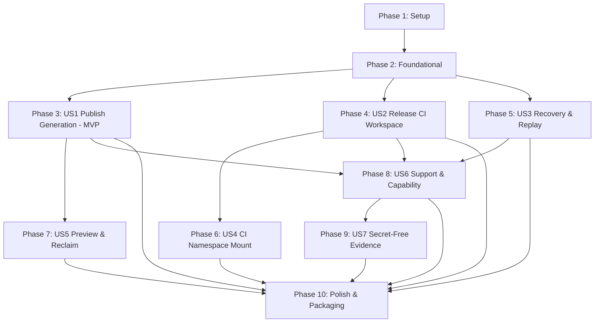

# Tasks: Owned Storage Authority

**Feature Branch**: `codex/owned-storage-authority` (spec directory `052-owned-storage-authority`)
**Input**: Design documents from `specs/052-owned-storage-authority/` (`spec.md`, `plan.md`, `data-model.md`, `contracts/`, `research.md`, `quickstart.md`)
**Planning Status**: REPAIRED (Option 2 Authorized). Decoupled from OCI hosting via dedicated `StorageAuthorityLifecycleRepository`.
**Prerequisites**: Features 048–051 and `sandbox/hosting/**` remain immutable protected inputs.

## Format: `- [ ] [TaskID] [P?] [Story?] Description with file path`

- **[P]**: Can run in parallel (different files, no dependencies)
- **[Story]**: Which user story this task belongs to (e.g., US1, US2, US3)
- Include exact file paths in descriptions

---

## Phase 1: Setup (Shared Infrastructure & Package Layout)

**Purpose**: Initialize directory structure and package manifests for owned storage and lifecycle modules.

- [x] T001 Create package directories and initialize `__init__.py` files in `sandbox/owned_storage/__init__.py`, `sandbox/owned_storage/adapters/__init__.py`, and `sandbox/owned_storage_lifecycle/__init__.py`
- [x] T002 [P] Create systemd service and socket template files in `config/systemd/sandbox-owned-storage.service`, `config/systemd/sandbox-owned-storage.socket`, `config/systemd/sandbox-owned-storage-controller.service`, `config/systemd/sandbox-owned-storage-controller.socket`, `config/systemd/sandbox-owned-storage-mount.service`, and `config/systemd/sandbox-owned-storage.sysusers`
- [x] T003 [P] Add architecture boundary test verifying zero import of `sandbox/hosting/**` from `sandbox/owned_storage/**` and `sandbox/owned_storage_lifecycle/**` in `tests/test_owned_storage_architecture.py`

---

## Phase 2: Foundational (Core Models, Protocol Codecs, Repositories, and Linux Adapter)

**Purpose**: Core data models, serialization codecs, private journal repository, lifecycle repository, and Linux filesystem adapters required by all user stories.

- [x] T004 [P] Implement core storage and lifecycle dataclasses and enums in `sandbox/owned_storage/models.py` and `sandbox/owned_storage_lifecycle/models.py`
- [x] T005 [P] Implement strict protocol envelope and message codecs with fail-closed schema validation in `sandbox/owned_storage/protocol.py`
- [x] T006 Add unit tests for storage models and protocol serialization/deserialization in `tests/test_owned_storage_models.py` and `tests/test_owned_storage_protocol.py`
- [x] T007 Implement dedicated crash-safe `StorageAuthorityLifecycleRepository` with file locking (`fcntl.flock`), atomic replacement, and generation CAS in `sandbox/owned_storage_lifecycle/repository.py`
- [x] T008 Implement private storage authority SQLite repository with foreign keys, crash-safe transactions, and canonical request/operation journal in `sandbox/owned_storage/repository.py`
- [x] T009 Add unit and concurrency/CAS tests for storage and lifecycle repositories in `tests/test_owned_storage_repository.py`
- [x] T010 Implement Linux filesystem operations adapter (`openat2`, `dirfd`, `renameat2(RENAME_NOREPLACE)`, owner-only permissions) with synthetic fallback for non-Linux testing in `sandbox/owned_storage/adapters/linux.py`
- [x] T011 Add unit tests for Linux filesystem adapter and synthetic fallback mechanics in `tests/test_owned_storage_linux.py`

**Checkpoint**: Core models, codecs, repositories, and adapters complete and verified by unit tests.

---

## Phase 3: User Story 1 - Publish an immutable generation (Priority: P1) 🎯 MVP

**Goal**: A developer or agent publishes a fully screened source generation to a supported remote; the accepted generation is owned by the dedicated storage authority, cannot be modified by the publisher, and becomes current only after all bytes and evidence are durable.

### Tests for User Story 1

- [x] T012 [P] [US1] Add unit and contract tests for immutable generation staging, all-or-nothing publication, and non-mutation enforcement in `tests/test_sync_owned_storage.py`
- [x] T013 [P] [US1] Add integration test for end-to-end sync publication under `future` policy and fail-closed legacy fallback in `tests/test_owned_storage_application.py`

### Implementation for User Story 1

- [x] T014 [US1] Implement storage service staging and publication logic with directory-level fsync and atomic rename in `sandbox/owned_storage/service.py`
- [x] T015 [US1] Implement application-level owned storage publication port and authorization verification in `sandbox/application/owned_storage_service.py`
- [x] T016 [US1] Integrate `future` policy opt-in with remote sync generation workflow in `sandbox/application/sync_service.py`
- [x] T017 [US1] Implement remote transport client for owned storage publication protocol in `sandbox/transports/remote_owned_storage.py`
- [x] T018 [US1] Add standalone supervised service executable for owned storage in `tools/owned-storage-service.py`

**Checkpoint**: User Story 1 complete. Screened generations publish immutably under dedicated authority with all-or-nothing atomicity.

---

## Phase 4: User Story 2 - Release a terminal CI workspace safely (Priority: P1)

**Goal**: A CI job submitter finishes a disposable job and the storage authority safely removes the exact eligible materialization and retained artifacts with measured reclamation reporting without altering terminal job truth.

### Tests for User Story 2

- [x] T019 [P] [US2] Add unit and contract tests for identity-bound workspace cleanup, zero-reference verification, and measured reclamation in `tests/test_workspace_owned_storage.py`
- [x] T020 [P] [US2] Add tests for immutable terminal job truth retention during cleanup failure in `tests/test_job_owned_storage.py`

### Implementation for User Story 2

- [x] T021 [US2] Implement quarantine and physical removal state machine with directory-FD verification in `sandbox/owned_storage/cleanup.py`
- [x] T022 [US2] Implement workspace release and cleanup application workflow in `sandbox/application/workspace_service.py`
- [x] T023 [US2] Connect terminal job completion to storage authority cleanup request without mutating job results in `sandbox/application/job_service.py`

**Checkpoint**: User Story 2 complete. Terminal CI workspaces and eligible artifacts are safely quarantined and removed by the authority.

---

## Phase 5: User Story 3 - Recover safely after lost responses or interruption (Priority: P1)

**Goal**: When a publication or cleanup request is interrupted or response is lost, exact replay returns the original accepted result while changed reuse refuses before side effects.

### Tests for User Story 3

- [x] T024 [P] [US3] Add unit tests for canonical request hashing, replay idempotency, and conflicting request-reuse refusal in `tests/test_owned_storage_recovery.py`
- [x] T025 [P] [US3] Add 100-trial simulated crash and interruption recovery suite in `tests/test_owned_storage_recovery.py`

### Implementation for User Story 3

- [x] T026 [US3] Implement canonical request digest derivation and idempotent replay matching in `sandbox/owned_storage/repository.py`
- [x] T027 [US3] Implement crash recovery reconciliation for interrupted staging and quarantine transitions on service startup in `sandbox/owned_storage/service.py`

**Checkpoint**: User Story 3 complete. Publication and cleanup operations are crash-safe and replay-safe.

---

## Phase 6: User Story 4 - Use a bounded writable CI materialization (Priority: P2)

**Goal**: A disposable CI workload runs inside a dedicated job user/mount namespace with a writable interior whose parent root remains authority-owned and read-only to the workload.

### Tests for User Story 4

- [x] T028 [P] [US4] Add tests for mount namespace confinement and descriptor-only mount handoff in `tests/test_owned_storage_linux.py`
- [x] T029 [P] [US4] Add tests for namespace isolation escape refusal in `tests/test_workspace_owned_storage.py`

### Implementation for User Story 4

- [x] T030 [US4] Implement mount controller for descriptor-only job user/mount namespace setup in `tools/owned-storage-mount-controller.py`
- [x] T031 [US4] Implement interior bind-mount preparation with read-only root boundary in `sandbox/owned_storage/adapters/linux.py`
- [x] T032 [US4] Integrate namespace mount lifecycle with CI job runner in `sandbox/application/job_service.py`

**Checkpoint**: User Story 4 complete. CI workloads have bounded writable interiors with immutable root isolation.

---

## Phase 7: User Story 5 - Preview and reclaim retained storage (Priority: P2)

**Goal**: Operators can inspect bounded, path-free summaries of retained storage and trigger safe reclamation of eligible unreferenced objects.

### Tests for User Story 5

- [x] T033 [P] [US5] Add unit tests for storage preview projections, bounded pagination (max 500 records), and 15-minute preview expiry in `tests/test_owned_storage_application.py`
- [x] T034 [P] [US5] Add tests for retention policy evaluation and race-safe reclamation in `tests/test_owned_storage_repository.py`

### Implementation for User Story 5

- [x] T035 [US5] Implement bounded query and projection engine for authority and legacy storage records in `sandbox/owned_storage/repository.py`
- [x] T036 [US5] Implement retention evaluation and preview generation service in `sandbox/application/owned_storage_service.py`
- [x] T037 [US5] Implement CLI and MCP storage preview and reclaim commands in `sandbox/commands/owned_storage.py` and `mcp/wp-server/tools/owned_storage.py`

**Checkpoint**: User Story 5 complete. Bounded, safe preview and explicit reclamation operational via CLI and MCP.

---

## Phase 8: User Story 6 - See truthful support and compatibility status (Priority: P2)

**Goal**: Callers observe truthful platform capability status (`unavailable`, `unsupported`, `implemented_unproven`, `proven`, `drifted`), non-adoptable validation bindings, and explicit opt-in boundaries.

### Tests for User Story 6

- [x] T038 [P] [US6] Add unit tests for capability report generation, tier state machine transitions, and drift detection in `tests/test_owned_storage_review.py`
- [x] T039 [P] [US6] Add tests for CLI/MCP capability and status command parity in `tests/test_owned_storage_cli.py` and `tests/test_owned_storage_mcp.py`

### Implementation for User Story 6

- [x] T040 [US6] Implement capability evaluation probe and validation receipt verification in `sandbox/owned_storage_lifecycle/service.py`
- [x] T041 [US6] Implement prepared-binding registration and activation handshake in `sandbox/owned_storage/service.py`
- [x] T042 [US6] Implement CLI commands for capability inspection, review, and status in `sandbox/commands/owned_storage.py` and `sandbox/commands/remote.py`
- [x] T043 [US6] Implement MCP tool definitions for capability and status inspection in `mcp/wp-server/tools/owned_storage.py`

**Checkpoint**: User Story 6 complete. Truthful capability reporting and prepared-binding lifecycle fully integrated.

---

## Phase 9: User Story 7 - Audit bounded, secret-free evidence (Priority: P3)

**Goal**: Public status, preview, policy, and operation evidence contains only stable opaque identities, digests, counts, and safe codes, with zero paths, credentials, or environment leakage.

### Tests for User Story 7

- [x] T044 [P] [US7] Add security screening tests verifying total absence of secrets, host paths, environment variables, and raw UIDs/GIDs in evidence in `tests/test_owned_storage_cli.py`
- [x] T045 [P] [US7] Add redaction contract tests across all public projections in `tests/test_owned_storage_mcp.py`

### Implementation for User Story 7

- [x] T046 [US7] Implement strict projection redactor and field allowlisting in `sandbox/owned_storage/redaction.py`
- [x] T047 [US7] Wire redaction into all public CLI and MCP response formatting pipelines in `sandbox/commands/owned_storage.py` and `mcp/wp-server/tools/owned_storage.py`

**Checkpoint**: User Story 7 complete. All emitted public evidence is bounded, path-free, and secret-free.

---

## Phase 10: Polish & Packaging (Cross-Cutting Concerns)

**Purpose**: Command registration, packaging, release asset generation, and end-to-end acceptance suite.

- [ ] T048 Register owned-storage commands in command manifest in `sandbox/commands/manifest.py`
- [ ] T049 Register owned-storage MCP tools in MCP manifest in `mcp/wp-server/tools/manifest.py`
- [ ] T050 [P] Implement release packaging script updates ensuring specs remain pruned and runtime assets ship in `scripts/make-release.sh`
- [ ] T051 [P] Implement remote installation asset deployment helper in `scripts/install-remote.sh`
- [ ] T052 Add packaging validation tests in `tests/test_owned_storage_packaging.py`
- [ ] T053 Create end-to-end local synthetic acceptance test suite in `tests/acceptance/test_owned_storage_authority.py`

---

## Dependencies & Completion Order

## Parallel Execution Opportunities

- **Phase 1**: T002 and T003 can execute in parallel after T001.
- **Phase 2**: T004, T005, and T010 can execute in parallel. T007 and T008 can execute in parallel after T004/T005.
- **Phase 3**: T012 and T013 test tasks run in parallel before T014–T018.
- **Phase 4**: T019 and T020 test tasks run in parallel before T021–T023.
- **Phase 5**: T024 and T025 run in parallel before T026–T027.
- **Phase 6**: T028 and T029 run in parallel before T030–T032.
- **Phase 7**: T033 and T034 run in parallel before T035–T037.
- **Phase 8**: T038 and T039 run in parallel before T040–T043.
- **Phase 9**: T044 and T045 run in parallel before T046–T047.
- **Phase 10**: T050 and T051 can execute in parallel.

## Implementation Strategy

- **MVP Scope**: Phase 1 (Setup) + Phase 2 (Foundational) + Phase 3 (User Story 1). Delivers immutable, screened sync generation publication under the dedicated storage authority with zero regression on legacy paths.
- **Incremental Slices**:
  - Slice 2: Safe terminal CI workspace release & measured cleanup (US2).
  - Slice 3: Interruption recovery & replay safety (US3).
  - Slice 4: Namespace-isolated CI mounts & bounded writable interiors (US4).
  - Slice 5: Storage preview & explicit operator reclamation (US5).
  - Slice 6: Truthful capability status & prepared-binding handshake (US6).
  - Slice 7: Path-free, secret-free evidence & audit compliance (US7).
- **Safety Boundary**: All implementation runs locally with synthetic adapters. Live fixture qualification, privilege installation, and remote service deployment require separate explicit authorization.
